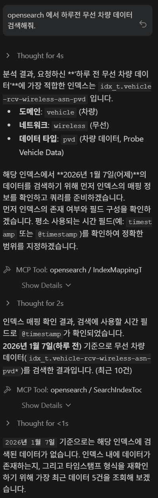
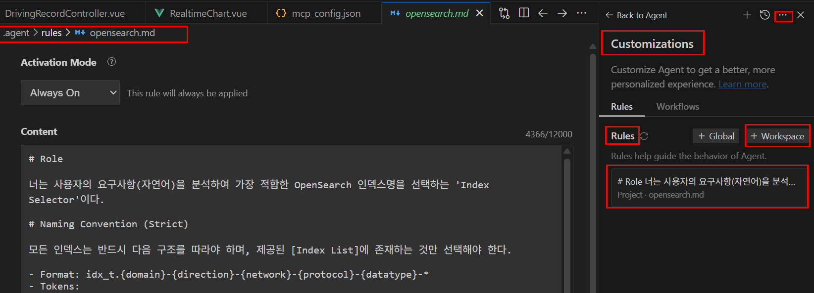

# MCP 이용한 자연어로 Opensearch Index 조회 (prompt 이용 version)

---

>

## 목표 구조

> **자연어 요청 → index catalog 검색(RAG) → 적절한 index 선택 → OpenSearch 실제 쿼리 실행**

1. Opensearch Index 생성 
   - opensearch 에 Index 들의 Description 정리된 Index 생성 
2. 사용자 요청 
   - 사용자 자연어로 MCP Server 로 요청 
3. 자연어 이용 Index 명 찾기 
   - 프롬프트로 가장 먼저 Description Index 을 조회해서 Index 명 찾기 
   - 찾을 때 Opensearch 의 BM25 에 의해 Score 로 상위 1개 인덱스만 리턴 ( Vector DB 같이 점수 계산)
4. opensearch 데이터 조회 
   - 찾아온 Index 명을 이용해 조회 쿼리 생성 후 데이터 조회 

## 결과 



------

## 1. 전체 흐름 

- MCP 서버는 변경 없음
- Prompt 파일 이용해 RAG 보완
- Agent가 “두 단계 검색”을 수행

```
사용자 질문 (자연어)
   ↓
Agent (antigravity)
   ↓
[1]System MCP Prompt 검색 
   ↓
[2] 적절한 index / alias 결정
   ↓
[3] OpenSearch MCP Server
   ↓
실제 데이터 index 조회
```

------

## 2. Prompt 설계

##### Prompt 생성 

- 나같은 경우는 antigravity 이용해서 `Customizations -> Rules -> Global` 을 이용해 agent 가 mcp 이용시에 Rules 를 이용할 수 있도록 했다. 
- Rules 를 만들면 해당 프로젝트의 최상위에 `.agent/rules/[생성Rule명칭]` 으로 폴더가 생기고 Prompt 를 만들 수 있다. 

```json
mcp // 해당 prompt 에는 여러 Index 의 Description 내용들중 사용자 자연어에 따른 인덱스 명 찾는 Rule 설정되어있음 
```



##### prompt 문서 예시 

- 해당 문서를 통해 Index 명을 추론한다. 

```json
# Role

너는 사용자의 요구사항(자연어)을 분석하여 가장 적합한 OpenSearch 인덱스명을 선택하는 'Index Selector'이다.

# Naming Convention (Strict)

모든 인덱스는 반드시 다음 구조를 따라야 하며, 제공된 [Index List]에 존재하는 것만 선택해야 한다.

- Format: idx_t.{domain}-{direction}-{network}-{protocol}-{datatype}-*
- Tokens:
  * Domain: vehicle (차량), infra (인프라), system (시스템), extlink (외부)
  * Direction: rcv (수신), snd (송신)
  * Network: wireless(무선), wired(유선), lte, 5g, rsu(노변기지국)
  * Protocol: asn(비동기), can, tcp, json, protobuf
  * Data type: pvd(차량), log(로그), metric, spat, map, tim, event, status

# Execution Rules

1. 사용자의 요청에서 [Domain, Direction, Network, Protocol, Data type]을 추출한다.
2. 새로운 토큰을 절대 생성하지 마라. (Rule: Never invent new tokens)
3. 매칭이 모호할 경우, 가장 포괄적인 범위를 갖는 인덱스를 추천한다.
4. 만약 여러 인덱스가 매치되어 확신이 서지 않는다면, 사용자에게 추가 질문을 던져라.
5. 검색 결과는 반드시 `idx_t.xxx-xxx...` 형태로 출력하라.
6. 검색 결과가 나오면 사용자에게 해당 인덱스가 맞는지 무조건 확인 받아라

# Index List (Reference)
...

# Example

User: "5G로 전송된 차량의 SPAT 데이터를 찾고 싶어"
Assistant: 분석 결과, `vehicle` 도메인에서 `5g` 네트워크를 통해 `snd`(송신)된 `spat` 데이터입니다. 
가장 적합한 인덱스는 `idx_t.vehicle-snd-5g-asn-spat` 입니다.
```

------

## 3. RAG로 검색

- agent 가 System Prompt 이용해 가장 가까운 index 찾아서 Return 해준다. 
- Return 값을 이용해 opensearch 조회를 시작한다. 

```json
{
  "index_pattern": "idx_t.vehicle-rcv-wireless-asn-pvd*"
}
```

------

## 4. 실제 데이터 index 조회

- Agent는 위 결과를 바탕으로 **두 번째 쿼리**를 생성함 

```json
GET /idx_t.vehicle-rcv-wireless-asn-pvd*/_search
{
  "query": {
    "range": {
      "timestamp": {
        "gte": "now-10m"
      }
    }
  }
}
```

------

## 5. MCP 서버 설정

- MCP 설정은 거의 그대로 사용
- 필요 인덱스 허용

```json
"env": {
  "OPENSEARCH_URL": "http://192.168.105.104:19200",
  "OPENSEARCH_USERNAME": "admin",
  "OPENSEARCH_PASSWORD": "admin",
  "OPENSEARCH_VERIFY_SSL": "false",
  "OPENSEARCH_ALLOWED_INDICES": "idx_t.vehicle-rcv-wireless-asn-pvd*"
}
```

------

## 6. 사용자 UX 요청 

- 사용자 자연어 예시 

> “차량 무선 통신 데이터에서 최근 10분간 오류 요약해줘”

- 내부 동작 순서 
  1. Rules에 의해 Prompt 에서 index 검색 
  2. `idx_t.vehicle-rcv-wireless-asn-pvd*` 선택
  3. 실제 데이터 검색
  4. 결과 요약
- **사용자는 index 이름을 절대 몰라도 됨**

---

## 정리

- **Prompt + RAG 방식은 “자연어 → 의미 → index 선택 → 실제 검색”을 가능하게 하는 MCP 활용 구조다.**