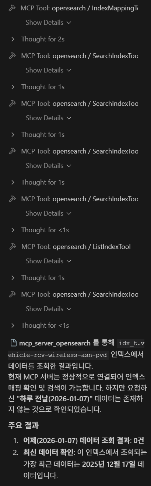

# opensearch MCP 연결

---

>

## 주의사항

1. venv는 “설치와 격리”를 위한 것이고 Agent는 venv를 활성화하지 않으며 `mcp_config.json`의 `command`가 가리키는 실행 파일만 실행한다.
   - 즉, venv 활성화 후 MCP 서버가 실행되어 있어야 MCP 에서 접근해서 사용할 수 있다. 
   - agent 이용해서 mcp 서버통해서 opensearch cluster 조회 
2. command에 venv/bin 경로를 직접 써야 한다

## MCP 연결 방법 

##### 핵심 키워드

- **원하는 파일 경로에 `venv/` 폴더 생성 후 MCP 서버 설치. -> 그 후에 agent 설정에서 command 통해 mcp server 실행**

##### 1. pip install

- MCP 서버가 구동될 런타임의 안정성을 보장
- `python3-full` 패키지를 설치함으로써 표준 라이브러리의 누락 방지

```bash
sudo apt-get install -y python3-pip python3-venv python3-full
```

##### 2. venv 생성 (최초 1회)

1. venv는 “MCP 서버 전용 디렉터리”에서 만들고, MCP 서버는 그 디렉터리에서 실행해야 한다. 

   ```bash
   # 현재 디렉터리에 venv/ 생성
   python3 -m venv venv
   ```

2. venv 활성화

   ```bash
   source venv/bin/activate
   
   # 성공시 프롬프트 예시 (이 상태에서 mcp server install 진행 ) -> 패키지는 venv 안에만 설치됨
   (venv) user@host$
   ```

3. 패키지 삭제

   ```bash
   pip uninstall opensearch-mcp-server-py
   ```

4. 확인

   ```bash
   pip list | grep opensearch
   ```

5. venv 비활성화

   ```bash
   deactivate
   ```

##### 3. mcp 서버 로컬 다운로드

- [공식 opensearch MCP Github](https://github.com/opensearch-project/opensearch-mcp-server-py)

```bash
# venv 활성화 상태에서 설치
pip install opensearch-mcp-server-py
```

##### 4. MCP 서버 실행 

- mcp server가 설치됐는지 확인하기 위한 명령어
- 주의할점!! : 실행 명령어가 패키지 버전에 따라 다를 수 있으니 확인 후 실행 

```bash
# venv 가상환경 실행한 곳에서 실행 (설치한 opensearch 프로젝트와 같은 이름으로 실행해야함)
# pip 패키지 이름은 “배포용 이름”이고, 실행 명령 이름은 “개발자가 정한 별명”이다. 

# 모듈 이름 찾기 
ls test-venv/lib/python3.12/site-packages | grep opensearch

# server 실행 
python3 -m mcp_server_opensearch
```


##### 5. MCP config 설정

- Agent 에서 mcp 설정에 opensearch 를 연결한다. 

- `venv/` 에 설치된 `opensearch mcp server` 에 접근해서 서버를 실행한다. 

  ```json
  "opensearch": {
    "command": "/home/meta/mcp-server/opensearch/test-venv/bin/python", // venv 설치 경로로 변경필요!
    "args": [
      "-m",
      "mcp_server_opensearch"
    ],
    "env": {
      "OPENSEARCH_URL": "http://IP:Port",
      "OPENSEARCH_USERNAME": "a",
      "OPENSEARCH_PASSWORD": "b",
      "OPENSEARCH_VERIFY_SSL": "false",
      "OPENSEARCH_ALLOWED_INDICES": "idx_t.vehicle-rcv-wireless-asn-pvd"
    }
  },
  ```
  
  