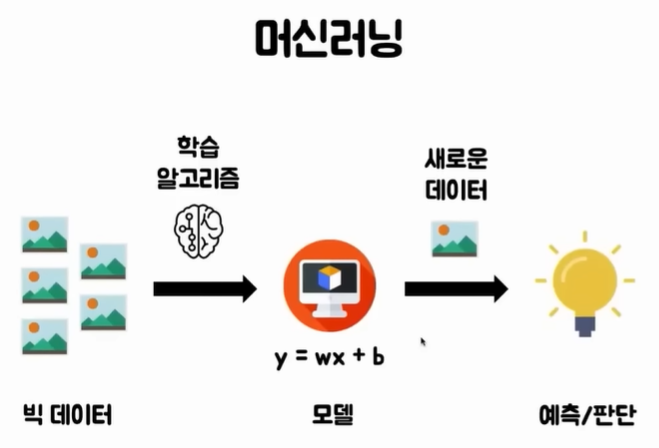

# 인공지능

---

> [유튜브 강의 - 인공지능](https://www.youtube.com/watch?v=mRnXgBDf_oE)
>
> [딥러닝 만들 수 있는 툴 for google](https://teachablemachine.withgoogle.com/)

## 인공지능

- 넓은 의미로 쓰이며 딥러닝과 머신러닝을 포함한 개념이다.

## 머신러닝

- 학습 알고리즘을 토대로 식을 찾아 해당 식을 이용해 추세를 찾아낸다. 
  - 딥러닝보다 성능이 떨어짐 

### 예시

1. 여러개의 값들이 있을 때, x 축과 y축으로 해당 데이터를 표시한다. 
2. 그다음 해당 점들과 가장 오차가 적은 일직선의 선을 찾는다. 
3. 해당 선을 식을 통해 표현한다. 
4. 식을 통해 다른 값들의 추세를 알 수 있다. 
   - 하지만 이상한 데이터가 들어오면 오차가 커진다는 단점이 있다. 

## 딥러닝

- 사람의 뇌의 뉴런들처럼 신경들을 여러층으로 쌓아 추세를 찾아내는 것

### 예시

- CNN 
  - 해당 이미지가 어떤건지 정답을 주고 **구역별 특징들을 추출**해 학습시키는 방법

