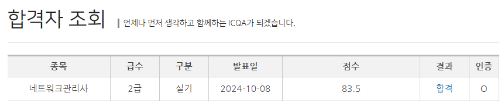

# 시험 후기 

---

>

## 합격인증!!!

## 전체평

1. 공인민간이라 민간 자격증 중에서는 그래~도 공부가 필요한 자격증!
2. 국가공인 자격증인 정보처리기사와 비교한다면 많이 쉬운것 같음

## 필기

1.  CBT 로 3개년치 연습문제 계속 돌리면서 풀이 및 해설 위주로 공부
2. 암기
   1. 나오는 보안 개념 및 단어, 프로토콜 등등은 암기함 
   2. 그래도 나중에 도움될만한 내용이라고 생각이 들어 공부하는데 재밌었다. 
3. 개념정리 
   1. 단어들이 은근 많았지만 정보처리기사 자격증을 딸때 공부해뒀던 개념들이 도움이 많이됨
   2. RAID 나 프로토콜, 보안개념 등등... 정보처리기사와 비슷한것들이 많아서 난이도는 쉬웠다고 생각함

## 실기

1. 필기보다 쉬웠음
   1. 필기는 여러 개념들이 나와 암기와 이해해야할게 많았다. 
   2. 하지만 실기는 라우터, 윈도우 서버 , 서비스 설정 같은 컴퓨터 설정 유형이 한정되어있어 양도 적고 쉬운편인거 같다. 
2. 다이렉트케이블
   1. 연습을 충분히 하고 실수만 안한다면 시간안에 충분히 통과 가능!! 나는 4분정도? 만에 완료하고 바로 윈도우 설정 및 단답형으로 넘어간거 같음... 
   2. 랜 툴 
      1. 랜툴은 나중에도 사용할 수 있을거같아 좋은걸로 구입. 구입시 반드시 피복제거기 사는게 좋음!
      2. 랜툴 자체에도 피복제거기가 있지만 그걸로 하면 더 어려운거같음... (피복제거기로 하면 진짜 간단하게 해결됨! )
   3. 다이렉트케이블을 완료하면 다음 시험에 대한 코드를 앞에 띄워주고 빨리 푼 사람부터 그 코드를 이용해 윈도우 설정 문제로 넘어가 시작할 수 있음. 
   4. 과목당 시간이 정해져있지만 더 빨리 끝내고 넘어가도 됨 
3. 윈도우 설정 및 단답형
   1. 윈도우 설정에는 꼼꼼히 읽고 연습만 한다면 비슷하기 때문에 풀만함 
   2. 다만 단답형에서 처음 보는 문제가 한개정도 나와 당황했었음
4. 라우터
   1. 총 3개 문제가 나오고 라우터 설정 하면 됨
   2. 여기서 1문제가 정적 라우터 설정 문제였는데, 이건 틀렸음. 
   3. 왜냐하면 연습할때 정적 라우팅에 대한 그림을 보고 연습을 하질 않아서 그림으로만 보여주니까 풀이를 이해하지 못함. 