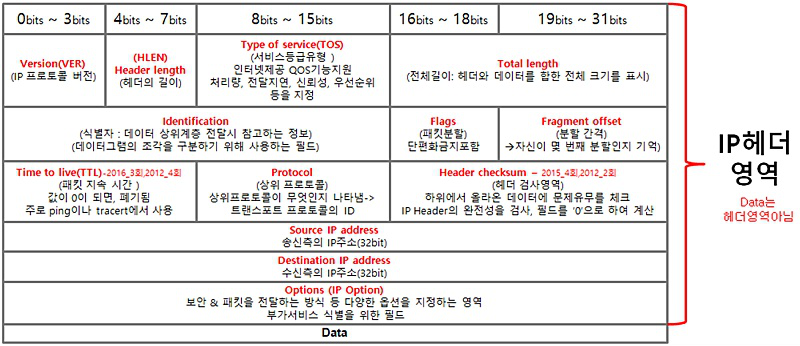

# [ 네트워크 관련 용어 ]

## < IEEE : Institute of Electrical and Electronics Engineers > 

- 전기 전자 기술자 협회
- 유선규격 (IEEE 802 LAN/MAN) 과 무선규격(IEEE 802.11 Wireless Networking) 이 있음

## < 이더넷 > 

- 여러 장치를 **LAN(근거리 통신망)으로 구축하기 위해 사용**되는  프로코콜 중 하나
- **CSMA/CD 프로토콜을 기반**으로 여러대 장치가 충돌하지 않도록 함
- 네트워크의 물리적 계층과 데이터 링크 계층을 의미
- NIC(네트워크 인터페이스 카드), 이더넷 케이블, 스위치, 허브와 같은 네트워크 장비는 L1 으로 정의
- L2 계층은 네트워크 장치가 다른 장치와 통신하는 방식과 데이터가 네트워크에서 전송되는 방식을 지정한다. 

## < CS : Carrier Sense > 

- **반송파 감지**
- 유선인터넷에서 가장 중요한 부분으로, 현재 케이블을 누가 사용하고 있는지 확인할때 사용
- 케이블에 신호보낼때 반송파를 이용함 
- Carrier : 데이터 전송하는 신호 

## < FTP : File Transfer Protocol > 

- 파일 전송 프로토콜 (서버와 클라이언트 간 파일 전송)
- 신뢰성 기반의 **TCP**  프로토콜 사용
- 대용량 파일을 서버에 업로드 하거나 다운로드 할 때 사용되는 프로토콜 (프로그램)
- 20, 21 번 포트 사용
- Active mode : 
  - 서버가 클라이언트로 직접 전달하는 방법 

- Passive mode : 
  - 클라이언트가 직접 연결해 가져가는 방식

## < TFTP : Frival File Transfer Protocol > 

- 비신뢰성 기반의**UDP** 사용한 파일 전송 프로토콜
- 69번 포트 사용

## < SSH : Secure SHell > 

- 보안이 강화된 **원격 접속 프로토콜**
- Telnet 의 평문전송 보완하기 위한 암호화 방식 추가된 프로토콜 
- Telnet : 
  - TCP/IP기반으로 원격을 하기위한 프로토콜이며 평문전송(암호X) 의 단점으로 인해 SSH가 사용됨

## < SSL : Secure Socket Layer > 

- 인터넷에서 **데이터 안전하게 전송하기 위한 프로토콜** 
- TLS ( Transport Layer Security ) 라고도함
- TLS는 전송 계층의 보안으로, 컴퓨터 네트워크에 통신 보안을 제공하기 위한 암호 규약이다. 

## < TTL : Time To Live > 

- DNS 에서와 네트워크 장비에서의 의미가 다르다. 
- **DNS** 
  - 데이터가 DNS서버 캐시로부터 나오기 전에 현재 남은 시간을 뜻한다. 

- **네트워크 장비** (IP 헤더에 포함 - 패킷)
  - 신호를 뜻하는데, 네트워크에 신호를 보냈을 때 원하는 정보 얻지 못해 카운트 0이 됐을 때 소멸하는 신호이다. 

## < DHCP : Dynamic Host Configuration Protocol > 

- **동적IP** 환경설정 프로토콜 
- IP 주소를 자동할당하는 서버 프로토콜

## < CSMA : Carrier Sense Multiple Access > 

- CSMA/CD : Collision Detection 으로, 유선 인터넷 통신 프로토콜 ( IEEE 802.3 ) 
- CSMA/CA : Colision Avoidance 로, 무선인터넷 통신 프로토콜 ( IEEE 802.11 ) 
- CS(Carier Sense) : 반송파 감지 
- MA(Multiple Access) : 다중 접속 
- CD (충돌 감지) : 
  - 네트워크에서 여러대 컴퓨터 동시에 데이터 전송하면 케이블 이용에 충돌 발생. 충돌 감지하면 전송 중지 후 반송파 통해 검사 후 다시 데이터 전송 

## < IDS : Intrusion Detection System >

- 침입 탐지 시스템
- 트래픽 분석, 로그 분석, 파일분석등을 통해 공격의 증거 찾음.
- IDS형태에는 NIDS, HIDS, SIV, LFM등이 있음.

## < IPS : Intrusion Prevention System >

- 침입 방지 시스템

## < PGP : Pretty Good Privacy >

- email과 관련된 보안 기술
- 공개키 암호화 방식 사용. 복호키 공개안하고 공개키만 공개해 데이터 암복화 진행 
- 전자우편 입수하더라도 복호화키 없기때문에 불가능

## < IPSec : IP Security protocol > 

- 3계층의 프로토콜에서 동작하는 보안 프로토콜
- **AH (인증헤더) 와 ESP ( 캡슐 보안 페이로드 )** 프로토콜로 구성됨
- 모든 패킷을 인증하고 프라이버시, 인증, 부인방지 기능 제공

## < S-HTTP : Security hypertext transfer protocol >

- 하이퍼텍스트 전용 규약(HTTP) 에 보안 기능을 추가한 통신 규약
- 인터넷 사용시 안전한 데이터 주고받기 위해 개발
- 유사기술에는 SSL 이 있다. 
- SSL은 클라이언트 인증이 선택적이고, S-HTTP는 **서버와 클라이언트 양방향 인증을 위해 증명서 반드시 필요**

## < MAC address > 

- 물리적 주소로, 장치에 제공되는 주소
- 16진수 48 비트로 이루어짐 

## < IP : Internet Protocol > 

- IPv4 : 10진수 32비트 
- 192.168.100.2 
- IPv6 : 16진수 128비트 
- 21DA:D3:0:2F3B:FF:FE28:9C5A

## < IPv4 >

- 5개의 클래스로 구분됨
  - A class : 0 ~ 127.255.255.255
  - B class : 128 ~ 191
  - C class : 192 ~ 223 
  - D class : 224 ~ 239 
  - E class : 240 ~ 255

- 유니캐스트, 멀티캐스트, **브로드캐스트** 사용
- 일반적으로 사용가능한 IP는 A,B,C 이며, D 는 **멀티캐스트**, E 는 연구 및 실험용으로 사용된다. 

## < IPv6 > 

- 별도 클래스로 구분되지 않음 
- 유니캐스트, 멀티캐스트, **애니캐스트** 를 사용 
- 처음오는 0000을 0 으로 축약 가능 
- 처음오는 연속되는 0 축약을 ':' 로만 표시 가능 

## < 유니캐스트, 브로드캐스트, 멀티캐스트 > 

- pc에서 다른 pc로 데이터를 전달하는 방식을 나눈것
- **유니캐스트** : 
  - 일반적인 ip데이터 전송으로, 
  - 1:1로 연결. **단일 송신자, 단일 수신자**간 통신 
- **브로드캐스트** : 
  - 같은 네트워크에 있는 모든 호스트에게 데이터 전송 
- **멀티캐스트** : 
  - 유니캐스트와 브로드캐스트 장점 합친것으로, 여러 신호를 **특정 수신자**에게만 보낸다. 
- **애니캐스트** : 
  - 1 : 1로 , **단일송신자와 가장 가까운 단일 수신자**와 통신 

## < RFID : Radio Frequency Identification > 

- 주파수를 이용해 ID를 식별 

## < WEP : Wired Equivalent Privacy > 

- 유선 동등 프라이버시 
- 유선과 같은 보안 서비스를 무선에서 제공하기위한 WiFi 보안 프로토콜 
- 무선 랜 표준을 정의하는WI-FI 표준 IEEE 802.11 규약의 일부분
- 무선 랜 운용간 보안을 위해 사용

## < 무선 보안 기술 발전 순서 > 

- WEP -> WPA -> WPA2

## < WPA :  Wi-Fi Protected Access >

- 무선 랜 보안 표준들 중 하나
- WEP 의 키 암호화를 보완해 **TKIP** 방식으로 KEY 생성 방식을 고도화한 기술이다. 
  - TKIP : 임시키 무결성 프로토콜 
  - WEP에서 Static 키만 사용하던걸 WPA 에서는 Dynamic 키 방식을 추가 

- WPA2는 WPA에다가 TKIP이 아닌 **AES**를 사용

## < WDM : Wavelength Division Multiplexing > 

- 파장 분할 다중화 
- 여러 **파장의 광신호**를 동일한 **광섬유 케이블**을 통해 동시에 전송하는 기술 
- 광증폭기를 통해 다중 파장 광신호를 증폭시켜 전송 거리를 늘린다. 

## < ARP 와 RARP > 

- 실질적인 데이터 전송과 수신은 물리주소인MAC을통해 이루어진다. 
- 하지만 대부분 인터넷할때는 논리주소인 IP 주소만 알고 있다 (IP주소는 계속 변경될 수 있음 ) 
- ARP : 
  - **IP주소를 이용해 MAC**주소 알아냄

- RARP : 
  - **MAC 주소 이용해 IP**주소 알아냄

## < NAT : Network Address Translation > 

- **사설IP 주소를 공인 IP 주소로 바꿔주는 역할**을 함
- 공인IP 1개만을 이용해 여러대의 사설망IP를 구성할 수 있음 
- 사설망IP로 접근하는게 불가능해 보안에 좋다. 
- 즉, 하나의 공인IP를 가진PC에 여러대의 사설망PC들이 연결되어 인터넷을 사용한다. 

## < VPN : Virtual Private Network > 

- 가상의 사설망
- 자체 정보통신망을 보유하지 않아도 **공중 데이터 통신망**을 이용해 마치 개인이 구축한 통신과 같이 운영/관리 할 수 있는 망 
- **터널링 기술** : 
  - 두 호스트 지점을 연결해주는 기술로, 사용자와 VPN 사이에 암호화된 연결을 만들어 인터넷 데이터 보호함

## < VLAN : virtual Local Area Network > 

- 가상 LAN :  물리적 제한을 최소화해 논리적으로 가상 랜을 구축하는 것 
- 공간개념이 아닌 랜의 접속포트, mac주소, 프로토콜 단위로 가상랜을 만들 수 있음
- 한 대의 스위치를 여러 개인 것처럼 사용해 하나의 포트로도 네트워크 정보 받을 수 있음

## < WLAN : Wireless Local Area Network > 

- 전파를 전송매체로 하는 무선랜 
- 802.11에서 사용
- 무선랜 구축방식 종류 ( Basic Service Set ) 
- 인프라스트럭처 BSS : 엑세스 포인트에 여러대의 스테이션을 연결하는 방식 
- 독립 BSS : 엑세스 포인트 이용하지 않아 짧은 사용시간과 작은규모에서 사용. 에드 혹 네트워크라고도 부름 

## < LAN > 

- 근거리 통신망 

## < 브릿지 >

- LAN 과 LAN을 연결

## < 게이트웨이 >

- **서로 다른 통신 프로토콜을 연결**
- 네트워크마다 **데이터 전송 방식이 다르기 때문에** (데이터 처리 방식이 다르기 때문에 ) 게이트웨이가 필요하다. 
- 다른 프로토콜 사용하는 네트워크와 직접 연결하면 데이터 공유 불가능 

## < ICMP : Internet Control Message Protocol > 

- 인터넷 제어 메시지 프로토콜
- L2와 L3사이에서 에러보고를 하는데 사용됨
- 운영체제에서 오류 메시지를 전송 받는데 사용됨
- 즉, 시스템간 자료를 주고받는 TCP , UDP와는 성질이 다름 
- **Ping , Tracert 명령이 대표적인 ICMP 명령어이다.** 
- 메시지 타입 : 0, 8, 11, 3, 4, 5
- **8** : Echo Request 요청
- **0** : Echo Reply 응답
- 3 : 도달할 수 없는 목적지에 패킷보낼때의 에러 메시지
- 4 : 서버 불안정시 전송 중단하라는 에러 메시지 
- 5 : 라우터의 목적지 설정보다 더 짦은 경로가 존재함을 알리고자 하는 메시지
- **11** : TTL 로, 타임초과 에러메시지

## < IGMP : Internet Group Management Pfotocol > 

- 인터넷 그룹 관리 프로토콜 
- 그룹을 관리하기 위한 프로토콜로, **멀티캐스트** 위해 개발됨
- 대표적인 **비대칭 프로토콜임** 
- 즉, 라우터가 호스트에게 네트워크 그룹에 해당하는 호스트의 정보를 수집하기 위해 사용 . 

## < 로드밸런싱 : load balancing > 

- 과부하시 **트래픽의 분산**을 의미
- 서버의 접속 이용자가 full이 되면 접속되지 않는 문제가 발생하는데, 이때 로드밸런싱을 이용해 2,3 대의 다른 서버로 분산시켜 과부하를 피한다.

## <스푸핑 : spoofing >

- 자신을 믿을만한 컴퓨터로 인식하도록. IP주소를 속이는 방법 

## < 루트킷 : rootkit >

- 사용자가 알아채지 못하도록 pc에 몰래 설치되는 프로그램
- 보안 시스템을 망가트리고 찾기 쉽지 않다.

## < 와이브로 : Wireless Brodband Internet >

- 휴대인터넷 서비스
- 2.3GHz 대역의 주파수 이용해 1Mbps 전송속도를 제공 
- 핫스팟, wifi보다 서비스 반경이 넓음
- IEEE 802.16e 에 부합함

## < 애드혹 네트워크 : ad-hoc > 

- 근거리 혹은 소규모 네크워크 
- AP(AccessPoint) 가 없이 흩어져있는 여러개의 무선 통신이 가능한 노드들을 이용해 통신하는 구조
- 먼 거리의 통신을 다른 노드를 경유해 통신 

## < 지그비 : Zigbee > 

- 저속 속도를 갖는 홈오토메이션 네트워크를 위한기술
- IEEE 802.15.4 에서 표준화 진행 
- 2.4GHz 주파수 사용하며 20~250Kbps 전송속도를 가짐
- 최대 128대 접속 지원. CSMA/CD 의 변형된 형태로 접속제어함

## < 프록시 서버 : Proxy Server > 

- 프록시 : 대리인 
- 데이터 중계에 사용됨
- 로컬 네트워크와 인터넷 중간에 설치되어 둘 사이의 **데이터를 중계** 
- 즉, 프록시 서버를 이용해 인터넷 검색을 하게 되는데, 검색 이전에 프록시 서버에서 사용한 정보가 있는지 체크하고 검색을 진행하여 데이터 전송 시간 향상 

## < 메일서버 종류 > 

1. MIME : 사용자간 바이너리 파일전송에 관한 인터넷 표준 
2. SMTP : 전자메일을 발신하는 서버를SMTP라고 함 
3. POP3 : 로컬로 메일 다운로드 시 전체가 로컬에 저장되고 서버 메일 삭제됨 
4. IMAP : 로컬로 메일 다운로드시 메일 제목 다운로드 되고 내용 보려고 할때 내용 다운로드됨 
5. SNMP : 간이 망 관리 프로토콜로 네트워크 장비를 관리하기 위해 만들어진 UDP 상에 정의되어 응용계층 표준 프로토콜 

## < SMTP : Simple Mail Transfer Protocol >

- 간단한 메일 전송 프로토콜 
- 메일 전송에 사용 

## < IMAP : Internet Message Access Protocol >

- 인터넷 메일 서버에서 메일을 읽기위한 프로토콜 

## < SNMP : Simple Network Management Protocol > 

- 소규모 네트워크 관리 프로토콜
- 네트워크 기기를 모니터링하고 관리

## < Qos : Quality of Service > 

- 데이터 흐름등에 우선순위를 정하여 데이터 전송에 일정한 수준의 품질과 성능을 보장 
- 주로 IPv6 와 TCP 같은 신뢰성 기반으로 하는 전송계층에서 사용 
- **L4 계층인 전송 계층에서 사용되어 데이터 전송 품질을 보장하는데 사용된다.** 

## < F/W : Fire Wall >

- 방화벽 

## < LAN 구성형태 > 

- 링형
- 스타형 : 허브와 UTP 케이블 이용해 중앙의 제어점과 모든 기기가 점대점 방식으로 연결 
- 버스형
- 트리형 

## < 라우팅 프로토콜 > 

- 라우터가 최적의 목적지를 찾아 데이터를 안전하게 전송하기 위한 경로를 정하는 프로토콜들을 뜻한다. 
- 동적 라우팅 프로토콜의 IGP와EGP 가 사용된다. 
- RIP (Routing Information Protocol ) : 
  - 거리백터 기반. 규모가 크고 복잡한 네트워크에서 사용 

- OSPF (Open Shortest Path First) : 
  - 자동링크(Link state)기반. 89번 포트 사용. 홉수 제한 없음. 변화있는경우에만 라우팅정보 교환 

## < TCP 와 UDP > 

- TCP : 신뢰성. 헤더( ACK, )
- UDP : 비신뢰성. 헤더( 송신측 포트, 수신측 포트, 헤더길이 16bit , 체크섬 )
- 체크섬 : 전송 중 세그먼트 손상여부 확인

## < 3 way handshake >

- A : 사용자, B : 서버
- 세션을 연결하기 위한 방법

1. SYN : A는 B에게 상호간 동기화(연결)을 요청
2. ACK/SYN : B는 A에게 OK신호(ACK) 와 동기화 요청 보냄(SYN)
3. ACK : A는B에게 최종적으로 OK신호(ACK)보냄
   1. 확인 신호로, 0인경우 확인번호 미포함, 1인경우 확인번호 유효함 

## < 4 WAY Handshake > 

- 세션을 종료하기 위한 방법 

1. ACK : 
   1. C가 브라우저 종료를 B에게 알림

2. FIN / ACK : 
   1. B가 C에게 연결 끊겠다고 신호 보냄

3. ACK -> FIN / ACK : 
   1. C가 B에게 연결끊는것에 대해 확인하고 연결 끊는 신호 보냄 

4. ACK : 
   1. B가 C에게 OK신호 보냄 

## < IOT : 사물인터넷 >

- 사람과 사물을 연결하는 인터넷 
- 유비쿼터스 : 모든 사물에 센서릉 달아 사람과 연결 

## < 에지 컴퓨팅 > 

- 데이터를 생산하는 지점에서 데이터를 처리 및 분석하는 컴퓨팅 기술 
- 중앙 데이터 센터로 보내기 전 데이터를 가공해 응답시간을 개선한 방법이다. 

## < 씬 클라이언트 :Thin client > 

- 자신의 계산 역할을 충족시키기 위해 다른 일부 컴퓨터서버에 크게 의존하는 컴퓨터
- 반대개념 : 펫 클라이언트 ( 독립적으로 역할을 수행 ) 

## < ARQ : Automatic Repeat Request > 

- 자동 반복 요청 기법
- 통신할때 **송수신에서 에러 확인시 재전송을 요청하는 기법**
- 기법 종류
  1. Go-Back-N 
  2. Stop and Wait : 정지-대기
  3. Selective Repeat : 선택적 재전송 
  4. Adaptive : 적응적 

## < Go-Back-N >

- 여러 블럭 연속 전송하고, 수신쪽에서 NAK 보내면 오류 발생 이후 **블록 모두 재전송**하는 방식
- NAK : Not Acknowledged 로, 통신 제어용 신호이며 수신시 데이터에 에러가 있음을 알림
- 뒷 내용 모두 다시 보내기 때문에 중복 문제 발생 

## < Stop-and-wait : 정지 대기 > 

- 송신측에서 데이터 보낸 후 수신측으로부터 응답 기다리는 방식

## < Selective Repeat : 선택적 재전송 > 

- HDLC 전송제어절차에서 사용하는 오류 제어 방식 
- 여러 블록 연속 전송 후, 수신측에서 NAK 보내면 손상된 블록만 전송
- go back n 방식과 차이점은 오류시 뒷부분 다 보내는지, 아님 오류 데이터만 보내는지이다. 

## < Adaptive : 적응적 >

- 전송 효율 최대화하기 위해 데이터 **블록 길이를 동적으로 변화**시키는 방식

## < SIP : Session Inition Protocol > 

- 멀티미디어 **세션을 제어하기 위해 사용되는 프로토콜** 
- UDP 프로토콜 사용 

## < MIME : Multipurpose Internet Mail Extension > 

- 다목적 인터넷 확장 메일 
- 전자우편은 7비트 아스키 문자 사용해 전송됨 
- 따라서 8비트 이상의 파일은MIME 포멧으로 변환해 SMTP로 전송해야함 
- 실질적으로 거의다 SMTP로 전송되는 것들은 MIME포멧이다. 

## < IPC : Internet Relay Chat > 

- **실시간 인터넷 채팅** 프로토콜 사용하는 채팅서버 및 틀라이언트 SW 
- 사용자 메시지가 인터넷 통해 릴레이된다는 의미 

## < HEVC : High Efficient Video Coding > 

- 고효율 비디오 토딩 기법 

## < 핸드오프 > 

- 통화 채널 자동으로 전환해주는 기능 
- 이동 중인 사용자가 현재 사용중인 셀(cell) 에서 다른 셀로 이동할 때, 이동 중에도 연결을 계속 유지하는 것 

## < 체널 체인징 > 

- 무선 통신에서 주파수 또는 체널 변경하는 행위 

# [ OSI 7계층 ]

## 물리

1. 리피터, 허브 
2. 비트
3. RS-232
4. Hub : 입력된 데이터를 모든 포트로 복제하여 전송해 전송 중인 데이터가 충돌할 수 있다. 
5. 리피터 : 신호 전송시 전송 거리가 멀면 감쇄현상이 발생하는데, 이때 리피터 이용해 신호를 증폭해 더 멀리 보낼 수 있다. 

## 데이터링크

1. 스위치, 브릿지, 랜카드
2. 프레임, 이더넷
3. 에러 탐지와 네트워크 부하 발생하지 않도록 흐름제어(Flow 제어: 흐름제어로, 패킷의 부하 제어)
4. Mac주소 이용해 데이터 전달 
5. 네트워크에서 통신하기 위한 관리와 에러관리, 목적지까지의 데이터 전송을 위한 주소체계 제공 
6. 충돌 도메인을 나눠준다. 
7. 접속 기기간 통신을 관리하며 신뢰도 높은 전송로로 변경하는데 사용 

## 네트워크

1. 라우터 
2. 패킷
3. IP, IPSec, ICMP , IGMP, ARP
4. TCP/IP환경이다. IP는 비연결형, 비신뢰성인UDP사용
5. 패킷 분할 및 병합기능만 재공. 패킷 재전송, 에러,흐름제어 x 
6. 패킷 : 일정 크기로 분할된 데이터와 제어정보를 포함하는 데이터 블록 
7. 두 노드 간 오류 없는 데이터 전송하고 논리적 주소를 사용 
8. 메시지를 짧은 패킷으로 나누어 전송 
9. 장애발생시 패킷 우회전송 가능. 패킷 전송시에만 전송로 사용해 설비 효율 좋음 
10. 다중화 이용해 복수 상대방과 통신가능 
11. ICMP 는 포트 없음 (IP네트워크의 일부이다)
12. IGMP가 대표적 비대칭 프로토콜로, TTL제공함 
13. 패킷 교환 방식
    - 가상회선 방식 : 연결혈
    - 데이터그램 방식 : 비연결형 

## 전송

1. 게이트웨이 
2. 세그먼트
3. TCP, UDP
4. TCP,UDP에는IP가 필요하다.
5. 로드벨런싱 사용 ( 부하분산으로, 특정 루트로 부하 발생하지 않도록 분산) 
6. 종단간 에러 탐지와 재전송 방법으로 에러 해결 
7. 송수신자 간에 통신를 위해 동기화 신호 주고받음
8. 다른 네트워크로 들어가는 입구 역할 
9. QOS(대역폭 조절해 서비스 효율 증가) 서비스 이용해 통신 품질, 지연시간, 데이터 손실률 보장 

## 세션

1. 메시지
2. SSH
3. 암호화, 복호화 

## 표현

1. 메시지
2. JPG , MPEG, PAP
3. 메시지 압축해 전송량 최소화
4. 스니핑통해 메시지 훔쳐볼수 있어 암호/복호, 인증, 압축 기능 수행

## 응용 

1. 메시지
2. HTTP, FTP, DNS, SMTP, SNMP
3. 프로그램 있는 계층 
4. 인터넷, 파일 업로드/다운로드, 네트워크 모니터링 위한 SNMP , 메일 발송을 하기위한 프로토콜들이 있다. 

## < DNS >

1. HTTP와 함께 TCP와 UDP사용하는 양다리 프로토콜 

## < TCP/IP 프로토콜 4 계층>

1. 패킷 통신 방식의 인터넷 프로토콜인 IP와 전송 계층의 TCP 프로토콜로 이루어진 프로토콜이다. 
2. IP프로토콜은 패킷 전달 여부를 보증하지 않아 보낸 순서와 받는 순서가 다르다. 
3. TCP프로토콜은 IP위에서 동작하는 프로토콜로, 데이터의 전달을 보장하며 순서대로 받을 수 있게 한다. 

## < TCP/IP 프로토콜 4 계층>

- 1 : 네트워크 액세스 계층 ( 물리, 데이터링크)
- 2 : 인터넷 계층 ( 네트워크 )
- 3 : 전송계층 ( 전송 ) 
- 4 : 응용계층 ( 세션, 표현, 응용 )

## < 계층별 스위치 > 

1. L2 스위치 : 데이터 전달에 MAC 주소 사용 
2. L3 스위치 : 데이터 전달에 IP주소 사용
3. L4 스위치 : IP와 PORT를 통해 데이터와 로드벨런싱 담당
4. L7 스위치 : 데이터 전달, 로드벨런싱, 햐킹 보안성기능 수행 

# [ IP 클래스 정리 ]

## < 사설망과 공인망 > 

1. A class 

 - 공인망 : 0.0.0.0 ~  127.255.255.255
 - 사설망 : 10.0.0.0 ~ 10.255 255 255 

2. B class

- 공인망 : 128.0.0.0 ~ 191.255.255.255
- 사설망 : 172.16.0.0 ~ 172.31.255.255

3. C class 

- 공인망 : 192.0.0.0 ~ 223.255.255
- 사설망 : 192.168.0.0 ~ 192.168.255.255

## < 네트워크 주소 > 

1. 127.0.0.1
   1. 루프백 주소로, 출발지 장비에서 신호가 나간 후 다시 출발지 장비에서 수신한다. 즉, 해당 장비 이상 여부를 체크할 때 사용한다. ( 네트워크 카드 테스트에 이용)
2. 0.0.0.0
   1. 모든 네트워크를 뜻한다. 

# [ 프로토콜 Port 정리 ]

| 프로토콜 | 포트 번호 |
| -------- | --------- |
| FTP      | 20, 21    |
| TFTP     | 69        |
| SMTP     | 25        |
| POP      | 110       |
| HTTP     | 80        |
| TELNET   | 23        |
| SSH      | 22        |
| HTTPS    | 443       |
| DNS      | 53        |
| SNMP     | 161       |
| OSPF     | 89        |

## < TCP 신뢰성 기반 프로토콜 > 

- 대부분 Tcp기반을 사용함 
  - FTP, Telnet, SMTP 등등.... 

- UDP인것 : 
  - SNMP(161), TFTP(69), IP

- TCP와 UDP인것 : 
  - DNS(53), HTTP(80), SIP(5060)

## < SIP : Session Initiation Protocol >

- 실시간 세션 통신를 관리하기 위한 프로토콜 

## < SSL > 

- TLS의 표준 
- SSL이 적용되면 HTTP가 HTTPS가 된다. 

# [ IP 헤더 ]

## < 주의사항 > 

- ACK은 포함 안함(TCP 헤더에 포함됨 )
- port 관련 정보 포함 안함(TCP/IP에 포함됨)

## < Flag > 

-  IP계층의 단편화 작업에 사용되는 헤더
-  단편화 = 패킷 분할
-  DF(Don't Fragment bit) : 1인경우 **단편화 금지**를 알림 (단편화 유무)
-  MF(more Fragment bit) : 1인경우 **재조합할 단편이 있음을 알림** 

## < fragment offset > 

- 데이터의 분할 위치 및 몇번째 분할인지 알림 

## < TTL > 

- hoc limit 이라고도 함 
- 패킷의 지속시간을 나타냄 
- **라우터 지나면 홉  -1 됨**
- 일정시간 지나면 사라지도록 하는것임. 계속 존재하면 과부히올 수 있기 때문에 

## < checksum > 

- IP헤더에 대한 검사만 하며 헤더의 오류 검출을 위해 사용
- 데이터는 헤더 영역 아님 

## < TOS : Type Of Service > 

- QOS 기능을 지원해 처리량, 전달지연을 지정 

## < option > 

- 보안 및 패킷전달 방식을 지정 

# [ TCP 헤더 ]

1. checksum(에러 제어), 
2. Data offset(헤더 길이, 데이터시작위치), 
3. sequence number(데이터 순서로, 세그먼트 순서파악가능), 
4. source port : 출발지 포트
5. Destination port : 목적지 포트 
6. 플레그 비트

## < TCP 플래그 비트 >

- 총 6개의 플래그 비트로 이루어져있다. 

1. **URG** : Urgent 
   1. 긴급하게 처리해야할 데이터가 들어가있다는 뜻. 1호설정되어있으면 순서 상관없이 먼저 송신

2. **ACK** : Acknowledgement 
   1. 1이면 유효, 0이면 확인번호 미포함. 확인응답 요청 또는 확인응답 이루어졌다는것을 뜻함

3. **PSH** : Push
   1. 데이터를 즉시 전달하라는것을 나타냄 

4. **RST** : Reset
   1. 재설정 하는 과정. 비정상적인 세션 연결을 끊는다. 연결확립된 회선을 강제 리셋하도록 요청

5. **SYN** : Synchronize Sequence Number
   1. 세션 설정에 사용. **시퀸스 번호 동기화**하라는 것을 나타냄

6. **FIN** : Finish 
   1. 세션 종료시키는데 사용됨

## < TCP 와 UDP 와 IP checksum >

1. TCP : TCP 헤더와 데이터가 재대로 전송 되었는지 검사
2. UDP : 전송 중 세그먼트의 손실여부를 확인 
3. IP : 데이터체크섬 제공 x, IP헤더의 완전성 검사 제공 

# [ 리눅스 구조 ]

## < 커널 : kernel > 

- **하드웨어와 os 를 연결**하고 관리 
- 리눅스 그 자체를 의미

## < shell > 

- 명령어 해석기 
- Kernel 에 명령어를 해석해서 전달하는 역할을 수행 
- sw 이용하기 위해 커널 통해서 명령전달 
  - 즉, GUI 에서 사용자 입력한 값이 shell을 통해 해석되며 kernel 을 통해 하드웨어에 명령하고 화면에 출력된다. 

- bash 쉘이나 power쉘 존재 

## < Loader > 

- 운영체제를 메모리에 로드하고 실행 

## < LILO : Linux Loader >

- **리눅스 부트로더**
- 다른 운영체제와 리눅스가 공존하는 환경에서 멀티부팅 할 때 사용
- **GRUB를 기본 부트**로 사용 

## < swap 영역 > 

- 윈도우의 가상메모리와 비슷 
- 어떤 프로그램 이용할때 메모리 부족하면 하드디스크의 여유공간을 임시 메모리로 사용하는 역할을 수행 

## < /home > 

- 사용자마다 **기본적으로 제공**되는 디렉토리 
- 새로 등록한 사용자는 관리자의 제한이 없으면 해당 디렉토리 안에서만 사용 가능 

## < /lib > 

- 시스템 동작을 위한 모든 명령과 **라이브러리가 설치**되는 디렉토리 
- 커널, 모듈 이 설치됨

## < /usr > 

- **시스템, 응용프로그램**에서 필요한 파일들이 저장됨
  - 일반 사용자가 사용

- 하위로는 /bin, /sbin, /local 이 있다.
  - bin : 바이너리 (명령어)
  - sbin : 시스템 바이너리 (시스템 명령어)

## < /var > 

- 시스템 운영시 생기는 **로그파일등 임시파일 저장**되는곳  
- 시스템 로그, 스풀, 전자메일 등 크기가 계속 변하는 파일들 저장 
- 하드웨어 적 이상 유무나 cpu, 커널등의 이상유무 로그로 저장함 

## < /tmp > 

- **프로그램 운영시** 불러들여야 하는 입출력 파일이 저장됨

## < /etc > 

- **시스템 설정파일**이 있는 디렉토리
- 암호 파일 및 네트워크 파일을 관리
- 시스템의 대부분 설정 파일이 존재하는 디렉토리

## < /bin > 

- **기본 쉘 명령어**의 실행파일을 가진 디렉토리
- 기본적인 시스템 실행 파일 가진 디렉토리
- ls, cp, md 같은 명령어 
- /sbin 디렉토리와의 차이점은 /sbin은 시스템 관리자 권한이 필요한 명령어를 가진다.
- 이 안에 있는 명령어는 어떤 경로에서든지 사용가능 

## < /proc >

- **프로세스의 정보**를 확인하는 명령어
- 프로세스 상태정보, 하드웨어 정보, 시스템 정보 확인가능 

## < /dev >

- 시스템에 장착되어있는 **장치(마우스, 모니터)를 파일로 처리**하여 저장 
- 각종 디바이스 드라이버 정보 저장 한 디렉토리 
- 마운트 지점을 제공

## < etc/passwd > 

- etc 디렉터리에 생성된 계정의 정보가 저장 

1. 파일 내용 => `user1:x:500:500::/home/user1:/bin/bash `
   - user1 : 계정명
   - x : 패스워드 정보 ( etc/shadow 파일에 별도로 저장되어있음을 의미 ) 
   - 500 : UID(유저ID)
   - 500 : GID(그룹ID)
   - /home/user1 : 홈디렉토리 경로
   - /bin/bash : 기본 설정 셸 

## < etc/named.conf >

- **DNS 서버 및 존 파일 설정** 관련 파일 

## < /etc/mtab >

- 현재 **마운트** 되어져있는 정보가 저장된 파일 

## < /etc/fstab >

- 부팅시 마운트 할 만한 자원에 대한 정보 

## < 데몬 : Daemon > 

- 서버의 역할을 수행하거나 그 기능을 도와줌 
- **백그라운드로 동작**해 시스템 서비스를 지원함
- 이벤트 발생시 동작하며 서비스 제공 후 대기 상태로 전환됨 

# [ 리눅 명령어 ]

## < traceroute > 

- 최적의 라우팅 경로를 찾는다 
- 윈도우에서는 tracert 로 사용한다.

## < pkill or kill > 

- 프로세스 킬로, 프로세스 신호를 종료시키는 명령어

## < history > 

- 이전 사용했던 명령어들을 조회 

## < halt > 

- 시스템 종료 
- t 옵션 : 강제 종료 

## < poweroff > 

- 시스템 종료 
- halt -p 와 같음 

## < reboot > 

- 시스템 재부팅 
- t 옵션 : 시스템 강제 재부팅 

## < top >

- 실시간 cpu사용율, 메모리 소비율 출력 

## < last > 

- 마지막 사용자 출력 

## < nohup > 

- **백그라운드에서 동작**할 수 있게함 

## < shutdown > 

- 시스템 종료
- h (시간:분) 옵션  :  시간 후에 시스템 종료 
- r (시간:분) 옵션 : 시간 후에 시스템 재부팅 
- c 옵션 : 예약된 shutdowm 명령 취소 
- shutdown -h 10:10  = 오전 10시 10분에 시스템 종료 예약

## < runLevel의 init > 

- 런레벨과 관련있는 명령어
- init 0 : **시스템 종료**
- init 1 : **단일 사용자** 모드(윈도우 안전모드와 같음)
- init 2 : **다중 사용자** 텍스트 모드 (네트워크 사용불가)
- init 3 : 다중 사용자 텍스트 모드 ( 네트워크 사용가능)
- init 4 : x
- init 5 : 다중 그래픽 사용자 모드 ( 윈도우 **GUI**와 같음)
- init 6 : **시스템 재부팅**

## < man : manual > 

- 도움말(메뉴얼)을 볼 수 있는 명령어 

## < pwd > 

- 디렉토리 위치 

## < passwd > 

- 계정생성

## < chmod > 

- 권한설정 ( -rw-r--r-- ) 
- rw- : 소유자 
- r-- : 소유 그룹
- r-- : 기타 사용자 
  - `+`: 권한 추가 
  - = : 권한 덮어 쓰우기 
  - a : 모든 사용자 
  - u : 소유자 
  - g : 소유 그룹
  - o : 기타 사용자 

- chmod ugo+w file : 소유자, 소유그룹, 기타사용자에 대해 파일의 쓰기 권한 추가 
- chmod go=w file : 소유그룹, 기타사용자의 권한을 w만 사용할수 있도록 변경 (이전 가진 권한 지워짐)

## < netstat : network status > 

- 프로토콜 통계 및 **네트워크 연결 상태** 파악
- 네트워크 인터페이스 상태 정보  
  - a : 모든 연결들과 수신 포트 표시
  - n : 주소와 포트번호를 숫자형식으로 표시 
  - s : 프로토콜별 통계 표시 
  - r  : 라우팅 테이블 표시 
  - p : PID와 사용중인 프로그램명 출력 
  - t  : TCP 로 연결된 포트 표시 
  - u : UDP로 연결된 포트 표시 
  - y : 모든 연결에 대한TCP 연결 탬플릿 표시 
  - e : 이더넷 통계 표시 

## < cron > 

- crontab과 같이 데몬의 작업설정에 사용
- 작업 예약에 사용됨 

## < crontab > 

- 사용자별 설정된 작업 **스케쥴 관리 파일** 
- 0 10 * * 1 /etc/check.sh => 매주 월요일 오전 10시에 실행됨
  - (`분 시간 일 월 요일 작업내용` )순서의 구조를 가진다. 
  - 요일은 0,7이 일요일, 1이 월
  - u 사용자명 : 특정 사용자 작업 스케쥴 관리 
  - e : 지정된 시간에 설정한 명령들 출력 
  - l : 설정된 crontab 작업 스케쥴 출력
  - r : 현재 사용자의 crontab 삭제 

## < free > 

- **시스템 메모리 체크** 명령어 
- 캐시, 버퍼, 잔여, 사용중인 메모리 등의 용량 확인가능 

## < cat > 

- 파일 내용을 텍스트로 확인 
- more : 파일 내용을 한페이지씩 불러옴

## < find > 

- 특정 조건의 파일 및 디렉토리 검색에 이용 
  - name [지정이름] : 지정된 이름의 파일 찾음 
  - User [지정소유자] : 지정 소유자의 파일 찾음 
  - Type [bcdfls] : 지정 형식의 파일 찾음 ( d : 디렉토리, f : 파일 ) 
  - size [+n] : 지정된 크기의 파일 찾음
  - perm : 지정 소유자의 권한 고려해 파일 찾음
  - lnum [ip노드번호] : 지정 ip노드번호와 파일 찾음 
  - exec : 찾은 파일에 대한 지정된 명령 실행
  - Print : 표준출력으로 검색된 파일명 출력 
  - o : or 을 의미해 명령어 중간에 들어감 

- 예시 : find /user/local -name *.jpg -o -name icqa => 지정폴더경로에서 파일형식이 jpg이거나 파일명이  icqa 인 파일을 찾는다. 

## < perfmon : performance Monitor > 

- 성능 모니터를 이용해 일정한 주기로 특정 데이터를 수집
- 서버의 성능 분석에 사용 

## < dfrg : Disk Defragment > 

- 시스템 유틸리티로, 디스크 관리에 사용

## < stat > 

-  특정 파일 및 디렉토리 정보 확인하는 명령어 

## < lsblk > 

- ls + block device 
- 리눅스 **디바이스 정보 출력** 명령어 

## < lsattr > 

- ls + attribute 
- **파일 속성**을 확인하는 명령어 

## < mkfs : make file system > 

-  리눅스 파일 시스템(포맷) 만드는 명령어 

## < nohup : No Hang up > 

- Hang up : 끊다
- 프로세스가 백그라운드에서 계속 동작되도록 하는 명령어
- 사용자가 로그아웃 또는 터미널 종료되어도 실행중이던 프로세스를 중단하지 않고 백그라운드에서 계속 작업할 수 있도록 하는 명령어 

## < sleep >

- 일정시간동안 리눅스 시스템 잠들게함 

## < last > 

- 리눅스 시스템에 접속한 마지막 사용자 접속정보 확인하는 명령어 

## < lastb > 

- 비인가자의 로그인 실패 이력을 확인하는 명령어 

## < chage : Change Age > 

- 계정의 만료시간, 패스워드 관리 등의 **계정 정보를 변경**하는 명령어
  - m 2 : 비밀번호 변경 후 최소 사용일 2일로 설정
  - M 100 : 비밀번호 변경 후 최대 사용일 100일로 설정 
  - W 10 : 비밀번호 만료 10일전 경고 메시지 표시
  - I 10 : 비밀번호 만료 후 10일 지나면 계정 비활성화 
  - E 2021-12-25 : 해당 날짜에 계정 만료 
  - L 10 : 10일 후 계정 잠금 

## < chown > 

- **파일의 소유권**을 변경하는 명령어. Root권한 필요
- 파일의 접근권한을 변경 = chmod

## < chgrp > 

- 파일의 소유자 그룹을 변경

## < useradd > 

- 사용자 계정 생성 

## < usermod > 

- 사용자 관리 명령어로, 사용자 계정 변경할 때 사용 

## < xferlog > 

- ftp서버의 전송로그를 확인하는 명령어 

## < fdisk > 

- 설치된 하드디스크 타입과 정보를 확인하고 편집하는 명령어 
- 파티션테이블을 관리 

## < fsck > 

- 파일 시스템 상의 오류 체크 명령어

## < mount > 

- 리눅스 시스템에 마운트로 지정 
- unmount : 마운트 해제 

## < df >

- 마운트 정보 및 **디스크 사용량 점검**하는 명령어 

## < ps >

- **프로세스 상태**와 유효여부를 확인하는 명령어 
- 특정 서비스를 제공하는Demon 이 살아있는지 확인
- top : 실시간 프로세스 상태확인  

## < vi편집기 명령어 > 

1. 치환 명령어 
   1. :[범위]s/찾을문자열/바꿀문자열/[플레그]
   2. :10,20s/new/old/g 
   3. 10~20행 까지 new 문자를 old 문자로 모두 치환 (플래그 안쓰면 하나만 바뀜)

2. 삭제 
   1. :10,20r/new/old 
   2. 10~20행까지 삭제 후 new 대신 old삽입. 
   3. x : 곱하기로 글자 지움. 5x는 다섯글자 삭제 

## < chsh > 

- shell 변경 

## < touch > 

- 빈 파일 만들기 

## < free > 

- 메모리 사용 현황 

## < userdel > 

- 사용자 계정 삭제 

## < 파일 입력 및 출력 >

- ls -al > output.txt => ls -al결과를 파일로 저장 
- cat ## < /etc/passwd => 파일 내용을 출력 

# [ Apache 웹서버 ]

## < Httpd.conf > 

- 아파치 **웹서버 운영**시 서비스에 필요한 여러 기능들을 설정하는 파일 

## < KeepAlive > 

- 한 프로세스가 특정 사용자의 요청을 지속적으로 허용하며 처리할지 여부를 설정. 기본은 off 

## < Timeout 시간초> 

- keepAlive가 on 일때 사용
- Timeout시간을 설정해 시간초 지나면 세션 종료 
- 기본 시간은 15초 

## < StartServers number >

- 아파치 시작시 생성되는 프로세스 수 

## < Listen > 

- 아파치 **웹서버의 서비스 포트**를 지정하는 부분 
- 기본 포트는 80
- www의 기본포트가 80

## < 상태 코드 > 

- 100 : 정보 제공 응답 
- **200** : 성공적 응답 
- 300 : 리다이렉트 
- **400** : **클라이언트**측 에러 메시지
- **500** : **서버**측 에러 메시지
  - 500 : 서버쪽에서 클라이언트 요청을 서비스 못함
  - 501 : 클라이언트 요청 내용 중 수행 불가 내용있음
  - 502 : Bad gateway 로 게이트웨이 경로 잘못지정 
  - 503 : server unavilable 서버 이용 불가

## < IIS 관리자 : Internet Infomation Service 관리자 > 

- **웹 서버를 관리**하기 위해 사용함 
  - 인터넷 정보 서비스 관리자 
  - 인터넷 기반 서비스 모임 

- 웹 서버를 설정하고 관리하는데 필요한 다양한 기능을 이용할 수 있다. 
  - 웹서버나 FTP서버 등을 구성하고 운영할 때 사용됨
  - FTP, SMTP, SNTP, HTTP/HTTPS(WWW) 를 포함한다. 
  - 웹 사이트의 웹문서 폴더 변경 가능 
  - 웹문서 추가 및 순서 조절 가능 

- 가상 디렉토리 이름은 실제 디렉토리 경로와 일치하지 않아도 된다. 즉, 논리 경로를 통해 다른 서버 폴더에 접근가능 
- 디렉터리 검색기능 이용하면 기본문서 없을 때 파일 목록표출 

# [ 윈도우 관련 서버 ]

## < 이벤트 뷰어 > 

- 윈도우의 로그를 통해 운영체제 관리하는 것
- 이벤트 생성 항목에 대해 **로그를 관리**하고 볼 수 있다. 
- **로그 종류 :**
  1. 시스템 , 
  2. 응용 프로그램(application), 
  3. 보안, 
  4. Setup, 
  5. Forward(해결책) Events 
- **이벤트 유형 :** (오정경 성실성)
  1. 오류, 
  2. 정보, 
  3. 경고, 
  4. 성공감사, 
  5. 실패감사, 
  6. 성공상세
- code 6005 : 부팅시
- code 6006 : 정상종료시 

## < FSRM : File Server Resource Management > 

- 파일 서버에 저장된 데이터를 관리 및 분류하는데 사용하는 윈도우 서버의 서비스이다. 

## < NTLM : NT Lan Management > 

- 윈도우즈에서 제공하는 인증 관련 프로토콜 중 하나 
- Challenge-Response 라는 인증 프로토콜 사용 

## < 메모리 : RAM > 

- 하드웨어보다 빠른 메모리로, 저장장치(HDD) 와 CPU(계산) 을 이어준다. 
- Swap : 가상메모리로, 하드디스크의 일정 부분을 지정하여 RAM 처럼 사용한다. 

## < FAT32 > 

- 윈도우즈 파일 포멧 유형 

## < NTFS > 

- 파일 시스템 중 하나로, 볼륨사이즈가 256TB
- FAT32의 업그레이드 버전 

## < ReFS : Resilient File System >

- 마이크로소프트의 스토리지 기술
- 탄력적인 파일 시스템
- NTFS 의 업그레이드 버전 
- 볼륨 사이즈 4.7제타바이트 

## < RAID > 

- 여러개의 물리적 디스크를 하나의 논리 디스크로 만드는 방법 

## < LVM >

- 리눅스의 디스크를 구성하는 기술 
- 리눅스도 RAID 지원 

## < Multihoming >

- 하나의 이더넷 포트에 여러개의TCP/IP주소를 갖게 함 
- 즉, **인터넷에 다중접속**하게 하는 기술로, 한 대의 서버로 여러개의 도메인 운영이 가능함
- 멀티호스팅, 멀티노딩, 멀티호밍 모두 같은의미

## < 방화벽 : firewall > 

- 외부 네트워크와 내부 네트워크 사이를 지나는 **패킷을 미리 정한 규칙에 따라 차단하거나 보내주는 기능** 
- 접근제어, 로깅과 감시추적, 메시지 인증, 사용자 인증, 클라이언트 인증 등을 수행 

## < BitLocker > 

- ms 윈도우와 서버에서 사용하는 완전한 **디스크 암호화 기능** 
- AES암호화 알고리즘 사용 

## < TPM : Trusted Platform Module > 

- 신뢰 플랫폼 모듈로, 컴퓨팅 환경에서 암호화 키를 저장할 수 있는 보안 처리자를 자세히 기록하는 기술
- ms윈도우에서 사용하는 디스크 암호화인 비트로커에서 사용하는 기술이다.
- 운영체제의 볼륨을 암호화하고 인증기능을 제공 

## < 계정 생성 >

- 운영체제 설치시 기본적으로 생성되는 계정 종류

1. Administrator : 관리자 
2. Guest : 로그아웃하면 삭제됨
3. DefaultAccount
4. Users : 기본 소속 그룹으로, 시스템 권한 변경시 root 또는 sudo 그룹에 속해야한다. 
   1. 자동 생성 x 
   2. Root : 리눅스 시스템의 관리자 계정으로, 자동생성 안됨

## < 도메인  그룹 >

1. 글로벌 그룹 : Global group 
   1. 로컬 도메인의 사용자만 가입 가능 
   2. 로컬 및 다른 도메인 자원사용가능 

2. 도메인 로컬 그룹 : Domain group
   1. 로컬 도메인과 다른 도메인 사용자 가입 가능 
   2. 다른 도메인 자원 사용 불가 

3. 유니버셜 그룹 : universal group 
   1. 1번과 2번 장점 가진 그룹 
   2. 그룹 가입이 모든 도메인에 개방됨
   3. 모든 그룹의 자원 사용 가능 
   4. 단점은 부하(Global Catalog)를 높이는 원인이 된다 

## < 도메인 Active Directory 구조 > 

1. Domain : 사용자 계정정보와 DNS 이용해 구별되는 하나의 object 단위 
2. Tree : 연속되는 영역 이름을 가진 하나 이상의 도메인
3. Forest : 연속되지 않는 영역 이름을 가진 하나 이상의Tree 
4. 트러스트 : 도메인이나 포레스트가 상호간 신뢰할지 여부를 나타내는 값 

# [ 윈도우 명령어 ]

## < eventvwr.msc > 

- 이벤트 뷰어 실행

## < compmgmt.msc > 

- 컴퓨터 관리 실행 
- Computer Management

## < secpol.msc > 

- 로컬 보안정책 관련 명령어
- Security
- policy : 정책 

## < certmgr.msc > 

- 인증서 관련 실행

## <devmgmt.msc > 

- 장치 관리자 실행 

## < diskmgmt.msc > 

- 디스크 관리자 

## < fsmgmt.msc >

- 공유폴더 관리

## < hdwwiz.cpl > 

- 장치관리 

## < wbadmin.msc > 

- 윈도우 백업 

## < msconfig > 

- 시스템 구성 유틸리티

## < ipconfig : Internet Protocol Configuration > 

- 로컬 컴퓨터의 설정된 **네트워크 값 정보**를 확인하는 명령어 
- ip, Gateway, SubnetMask 확인 가능 
- /release : DHCP 서버로 **IP 주소 반환** 
- /renew : 새로운 IP주소 받음 
- /flushdns : 시스템상 등록된 **dns 캐시 정보 비우기** (flush : 비우다 )
- /setclassid : 지정된 로컬 영역 어댑터에 Classid설정해 DHCP 를 테스트
- /all : 모든 정보 확인(MAC정보도 확인 가능) 
- 리눅스에서는 ifconfig 사용

## < ds 관련 명령어 : Directory Service > 

- 도메인 사용자 계정을 관리하기 위한 명령어 
  - dsadd : 디렉토리에 개체 유형 추가 
  - dsget : 디렉토리 개체 표시 
  - dsmod : 개체 수정 
  - dsrm : 개체 삭제 
  - dsquery : 검색조건에 해당하는 개체 찾기 
  - dsmove : 개체 이동 

## < nslookup [도메인이름]>

- **DNS조회**를 수행하는 명령어
- **IP주면 DNS정보 주고, DNS정보주면 IP정보 줌** 
- 도메인 이름 입력시 IP주소 알려줌

## < ping >

- 네트워크에 있는 호스트들 상대로 **상태 점검**할 때 사용 
- 패킷 왕복 시간으로 이상 여부 확인 
- 네트워크 오류 여부만 확인 가능 

## < tracer > 

- **패킷 경로** 살피는 명령어 
- 라우터 지날때마다 특정 메시지 보내서 라우터 존재 및 지연시간 검사 
- 접속하려는 호스트 정보까지 추적 가능 

## < pathping> 

- **ping + tracer** 
- 패킷 목적지로 보낼때 중간 경로의 라우터에서 리턴되는 패킷 결과 계산해 출력 
- 패킷 손실률과 중간 라우터까지 도착시간 포함 

# [ DNS 관련 개념 ]

## < cat/etc/resolv.conf > 

- **DNS 설정 파일** 내용을 담고 있는 파일(resolve.conf)을 수정(cat). 
- resolv.conf : DNS 서버를 저장하기위한 설정파일

## < round robin > 

- 시분할 기법으로 요청을 교대로 처리, 실행

## < SOA : Start Of Authority > 

- 권한 
- 해당 존 파일의 도메인에 대한 네임서버 인증 정보 
- 해당 존 파일에 대한 **네임서버를 유지하기 위해 필요한 기본적인 자료**가 저장됨 
- 존 파일은 **항상 SOA 로 시작**함 

## < ns.icqa.or.kr > 

- 해당 존 파일의 네임서버를 명시(주 서버)

## < master.icqa.or.kr > 

- 해당 네임서버 관리자 이메일 지정 
- master@icqa.co.kr 과 같은의미

## < Serial Number > 

- 존 파일이 최종 갱신된 data 
- Secondary DNS는 이 값이 Primary DNS 보다 작으면, Primary 로부터 해당 값을 재전송 받는다. 

## < Refresh > 

- 존 파일 변경여부를 검사하는 주기 
- secondary DNS 에서 Primary DNS 까지 검사진행
- 주 서버와 보조 서버의 동기 주기를 설정 

## < Retry > 

- 연결을 재시도 
- Secondary로부터 Primary로 연결되지 않았을 때 사용

## < Expire > 

- 만료시점으로, 지정 시간동안 Primary에 연결못하면 현재 가진 정보가 유효하지 않다고 판단
- 그 결과 도메인에 대한 응답 하지 않음 

## < minimum TTL > 

- 유효기간 설정 
- 다른 네임 서버가 존 파일에 기술된 자료를 가져갔을 경우 사용

## < TTL ( Time To Live ) >

- 해당 DNS 서버의 남은 시간 
- TTL이 길면 DNS 부하가 작아진다. 
- 길면 상위 네임서버에 질의하지 않고 바로 응답

## < DNS 서버의 레코드 Type > 

- 정방향 : 
  - 클라이언트가 DNS 제공하면 IP 주소 정보 제공 
  - A : DNS 이름과 IP주소를 연결.(A 는 IPv4주소와 연결 , AAAA는 IPv6와 연결 ) -> **DNS => IP**

- 역방향 PTR(pointer) : 
  - 클라이언트가 IP주소 를 제공하면 DNS(도메인) 정보 반환 -> **IP => DNS** 

- NS (Name Server) : 
  - 특정 도메인의 **DNS 정보를 관리하는 서버.** 
  - 즉, DNS는 전화번호 리스트 이고, NS는 전화번호 정보 가진 전화국이다. 

- SOA(Start Of Authority) :
  -  **DNS 영역에서 대한 권한 정보**를 가짐. 가장 큰 권한을 부여받은 호스트 정보

- CNAME : 
  - 실제 도메인 이름과 연결되는 **가상 도메인 이름**

- MX : 
  - **도메인의 메일 서버**를 식별해 메일 라우팅 제공

## < 하이퍼브이 : Hyper-V >

- **하드웨어 가상화** 또는 윈도우 서버 가상화 라고 함 
- 즉, 가상 기기들을 이용해 하드웨어 최소화 함 
- 하이퍼바이저 기반의 가상화 시스템 
- 가상 컴퓨터 마법사 등을 통해 메모리 할당, 가상 하드디스크 연결 등을 설정 
- 하드웨어 데이터 실행방지(DEP)가 필요
- 스냅숏 이용해 특정 시점 기록 
- 하나의 서버에서 여러개 가상 컴퓨터 구축가능 

1. 일련번호 : 해당 영역 파일의 개정 번호 
2. 주 서버 : 해당 영역 초기에 설정되는 서버 
3. 책임자 : 해당 영역을 관리하는 사람의 전자 메일 주소. @안씀
4. 새로고침 간격 : 보조서버가 주 서버의 변경을 검사하기 전 대기시간 

## < DNS 쿼리 >

- 재귀(Recursive) 와 반복(Iterator)으로 구분됨 
- 재귀 질의 : DNS서버를 차례대로 물어보는 방법. ( kr을 통해 kr의 도메인인 or.kr 을 얻고, or.kr을 통해 icqa.or.kr을 얻는다. ) 
- 반복 질의 : 직접관리하지 않는 DNS인 걍우 해당 DNS를 관리하는 NS 네임 서버를 연결 해주는 방법 

# [ IEEE 종류 ]

## < 802.1 >

- 브릿지 및 LAN 규격을 다루는 표준 

## < 802.2 >

- 논리적 링크 제어 서비스 제공
- 데이터 링크(L2) 에서 작동하는 프로토콜을 규정 
- LLC

## < 802.3 >

- 이더넷 표준 정의 
- L1과 L2에서 동작
- CSMA/CD
- 유선 네트워크 

## < 802.4 >

- Token Bus 

## < 802.5 >

- Token Ring 

## < 802.6 >

- Man

## < 802.7 >

- Brodband LAN 

## < 802.8 >

- Fiber Optic Lan 

## < 802.11 > 

- Wireless Network 
- 무선 네트워크 (WLAN) 표준 
- CSMA/CA 

## < 802.15.1 >

- 블루투스
- WPAN표준

## < 802.15.3>

- 고속 WPAN

## < 802.15.4 >

- zigbee
- 저속 WPAN