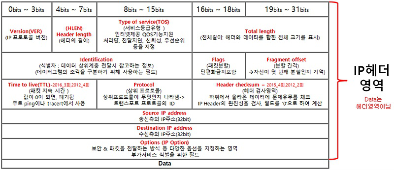
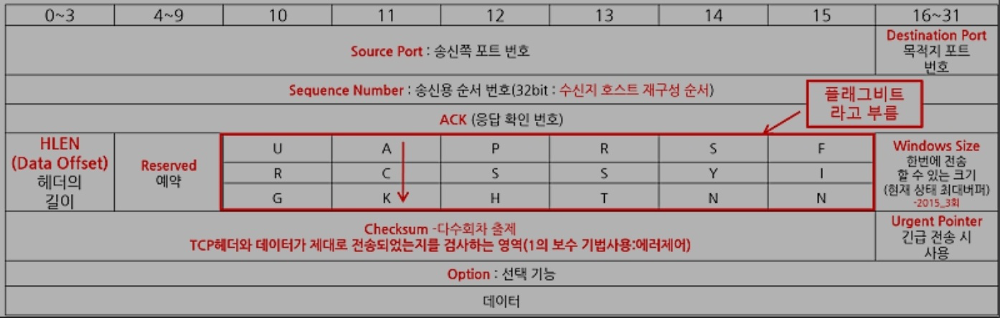

# [ IP 헤더 ]

## < 주의사항 > 
- ACK은 포함 안함(TCP 헤더에 포함됨 )
- port 관련 정보 포함 안함(TCP/IP에 포함됨)

## < Flag > 
-  IP계층의 단편화 작업에 사용되는 헤더
- 단편화 = 패킷 분할
- DF(Don't Fragment bit) : 1인경우 **단편화 금지**를 알림 (단편화 유무)
- MF(more Fragment bit) : 1인경우 **재조합할 단편이 있음을 알림** 

## < fragment offset > 
- 데이터의 분할 위치 및 몇번째 분할인지 알림 

## < TTL > 
- hoc limit 이라고도 함 
- 패킷의 지속시간을 나타냄 
- **라우터 지나면 홉  -1 됨**
- 일정시간 지나면 사라지도록 하는것임. 계속 존재하면 과부히올 수 있기 때문에 

## < checksum > 
- IP헤더에 대한 검사만 하며 헤더의 오류 검출을 위해 사용
- 데이터는 헤더 영역 아님 

## < TOS : Type Of Service > 
- QOS 기능을 지원해 처리량, 전달지연을 지정 

## < option > 
- 보안 및 패킷전달 방식을 지정 

# [ TCP 헤더 ]

1. checksum(에러 제어), 
2. Data offset(헤더 길이, 데이터시작위치), 
3. sequence number(데이터 순서로, 세그먼트 순서파악가능), 
4. source port : 출발지 포트
5. Destination port : 목적지 포트 
6. 플레그 비트

## < TCP 플래그 비트 >
- 총 6개의 플래그 비트로 이루어져있다. 

1. **URG** : Urgent 
   1. 긴급하게 처리해야할 데이터가 들어가있다는 뜻. 1호설정되어있으면 순서 상관없이 먼저 송신

2. **ACK** : Acknowledgement 
   1. 1이면 유효, 0이면 확인번호 미포함. 확인응답 요청 또는 확인응답 이루어졌다는것을 뜻함

3. **PSH** : Push
   1. 데이터를 즉시 전달하라는것을 나타냄 

4. **RST** : Reset
   1. 재설정 하는 과정. 비정상적인 세션 연결을 끊는다. 연결확립된 회선을 강제 리셋하도록 요청

5. **SYN** : Synchronize Sequence Number
   1. 세션 설정에 사용. **시퀸스 번호 동기화**하라는 것을 나타냄

6. **FIN** : Finish 
   1. 세션 종료시키는데 사용됨

## < TCP 와 UDP 와 IP checksum >

1. TCP : TCP 헤더와 데이터가 재대로 전송 되었는지 검사
2. UDP : 전송 중 세그먼트의 손실여부를 확인 
3. IP : 데이터체크섬 제공 x, IP헤더의 완전성 검사 제공 