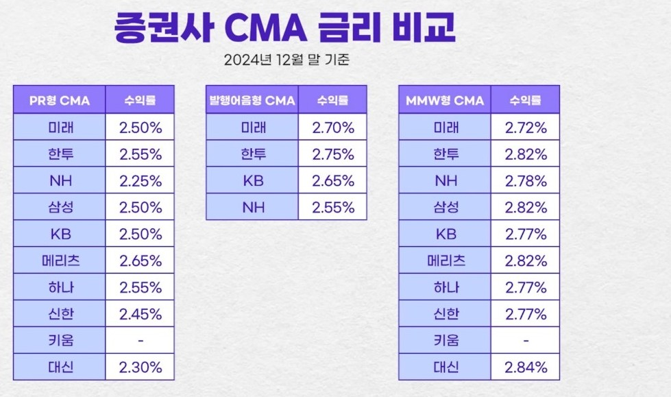

# CMA 계좌 

---

>

## 개념

1. 은행의 예금 계좌와 유사하지만 주로 증권사에서 제공하는 금융 상품
2. CMA 계좌는 투자와 예금을 결합한 형태로, 입출금이 자유롭고 일정 수준의 수익률을 제공하는 특징이 있다. 

## CMA와 일반 은행 통장의 차이

| **항목**    | **CMA**          | **은행 통장** |
| ----------- | ---------------- | ------------- |
| 이자율      | 높은 편          | 낮은 편       |
| 입출금      | 자유로움         | 자유로움      |
| 예금자 보호 | 상품에 따라 다름 | 예금자 보호   |
| 수익 방식   | MMF, RP 투자     | 단순 이자     |

## CMA의 주요 종류

1. **MMF형 (Money Market Fund)**
   - 단기 금융상품에 투자하는 펀드로 안정성이 높음
   - **가장좋음 ->** 하지만 온라인으로 만들 수 없고 직접 증권사 방문해야함
2. 발행어음형
   - 증권사가 자체적으로 발행하는 어음(채권)에 자금을 투자하여 수익을 창출
   - RP형 CMA보다 수익률이 높은 편
   - 바로 개설 가능 
3. RP형 (Repurchase Agreement)
   - 증권사가 일정 기간 후에 되사는 조건으로 채권을 판매해 운용

## CMA 계좌의 장단점

##### 장점

- 높은 이자 또는 수익률
- 입출금의 자유로움
- 소액 자금 관리에 유리
- 자동 투자 기능

##### 단점

- 예금자 보호가 제한적일 수 있음
- 투자 상품 특성에 따라 원금 손실 가능성(특히 MMF형)
- 금리 변동에 따른 수익률 변화