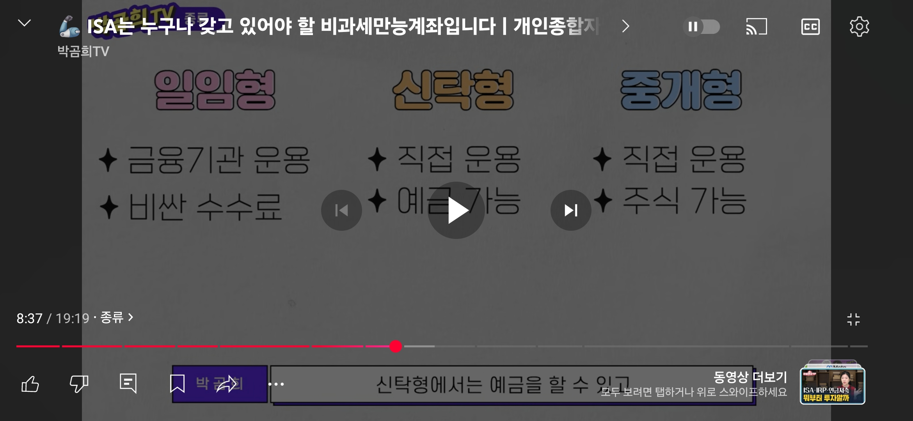

# ISA 계좌

---

>

## ISA(Individual Savings Account)

1. ISA(개인종합자산관리계좌)는 하나의 계좌에서 **다양한 금융 상품**(예금, 적금, 펀드, ETF, 주식 등)에 **투자**할 수 있는 **통합 계좌**이다. 
2. 금융 상품의 수익에 대해 일정 한도까지 비과세 또는 저율 과세 혜택이 주어지기 때문에 절세 목적으로 많이 활용한다. 

### ISA 계좌의 특징

1. 세제 혜택 제공
   - 운용 수익에 대해 **비과세 한도(200~400만 원)** 내에서 비과세 혜택 제공
   - 비과세 한도를 초과한 수익에 대해서는 **저율(9.9%) 분리 과세**
2. 다양한 금융 상품 투자 가능
   - 예금, 적금, 펀드, ETF, 리츠, 주가지수 연계 상품 등 다양한 자산에 투자 가능
3. 최대 운용 기간
   - 일반적으로 3~5년
   - 3년동안 원금만 뺄수 있고 이익본 금액은 뺄 수 없음 
4. 한 계좌만 개설 가능
   - ISA는 금융사 1곳에서만 1개의 계좌 개설이 가능합니다.

## ISA 계좌 단점

1. **의무 유지 기간:** 
   1. 보통 3~5년 유지해야 혜택 적용
2. 손실 가능성: 
   1. 투자 상품에 따라 원금 손실 위험
3. 제한된 비과세 한도
   1. 수익이 큰 경우 세제 혜택이 제한적

## ISA 계좌 유형

1. 신탁형 ISA
   - 투자 상품을 고객이 직접 선택
   - 예금, 적금부터 펀드까지 다양한 자산에 투자 가능
2. 일임형 ISA
   - 금융사가 자산 배분과 운용을 대신 관리
   - 투자 성향에 맞춘 상품 선택 가능
3. **중개형 ISA (최근 인기)**
   - 직접 주식 투자 가능 (상장 주식 포함)
   - 기존 신탁형과 일임형보다 투자 범위가 넓음

## 만기

1. 만기는 3 ~ 9999 까지 가능. 
2. 만기 원하는 경우
   1. ISA 계좌를 연장할 생각이 없다면 만기 전 모든 주식을 매도하자. 
   2. 늦어도 30일 이내 매도 하자. 
   3. 안 하면 ISA계좌가 만기 30일 후에 일반계좌로 변경되고 보유한 상품은 모두 일반계좌에 있게 된다.  
   4. 일반계좌가 되면 손익통산, 비과세, 절세 혜택 모두 사라진다.
3. 연금 전환 
   - ISA 계좌에 있는 금액을 연금 계좌로 전환(이체)할 수 있다. 
   - 전환금액의 10% 까지 추가 세액 공제가 가능하다. 
   - 즉, 만기 후 60일 이내에 ISA 계좌의 돈을 연금계좌로 이체하면 "연금전환" 효과로 인해 추가 세액 공제가 가능해진다. 
