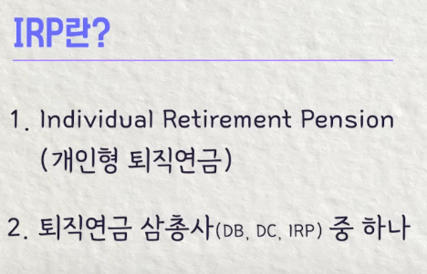
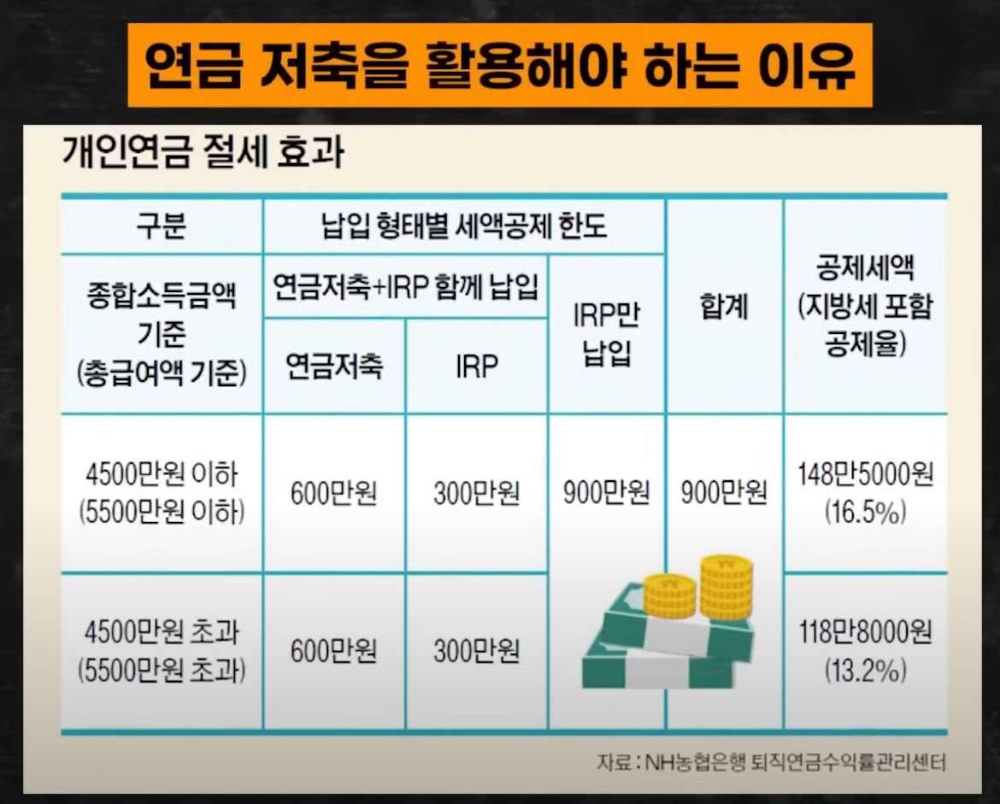

# 연금저축과 IRP 계좌

---

>

### **연금저축과 IRP(Individual Retirement Pension) 계좌란?**

1. 두 계좌 모두 **노후 자금 마련**과 **세액 공제** 혜택을 제공하는 금융 상품이다. 
2. 즉, 노후 준비를 위한 자금이기 때문에 나라에서 해택을 주는것이라 중간에 깨면 손해가 크다. 

## 1. 연금저축 계좌

###### 특징

- 은행, 보험사, 증권사에서 가입 가능
- 예금, 적금, 펀드, 보험 등의 상품에 투자 가능
- **최소 5년 이상 가입 유지 및 만 55세 이후부터 연금 수령 가능**

###### 세액 공제

- 연간 납입 금액 **600만 원 한도**까지

###### 연금저축 출금 조건

## 2. IRP(개인형 퇴직연금) 계좌

###### .특징

- 퇴직금을 관리하거나 개인 자금을 추가로 납입할 수 있는 계좌
- 주로 증권사나 은행에서 개설
- 예금, 적금, 펀드, ETF, 채권 등 다양한 상품에 투자 가능
- **퇴직금 수령 시 IRP 계좌로 수령하면 세제 혜택 제공**

###### 세액 공제

- 연간 납입 금액 **900만 원 한도(연금저축 포함)**

## 3. 연금저축과 IRP 비교

| **항목**       | **연금저축**           | **IRP**                                  |
| -------------- | ---------------------- | ---------------------------------------- |
| 세액 공제 한도 | 600만 원               | 900만 원**(연금저축 포함)**              |
| 의무 유지 기간 | 5년 이상, 만 55세 이후 | 만 55세 이후                             |
| 투자 상품      | 예금, 적금, 펀드, 보험 | 예금, 적금, 펀드, ETF, 채권 등등 더 많음 |

## 납입한도 및 공제금액

1. 가장 좋은건 연금저축 다 채우고 IRP 하는것
   1. 즉, 연금저축 600만원 다 채우는걸 목표로 하면됨

