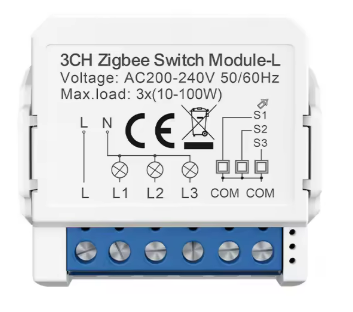
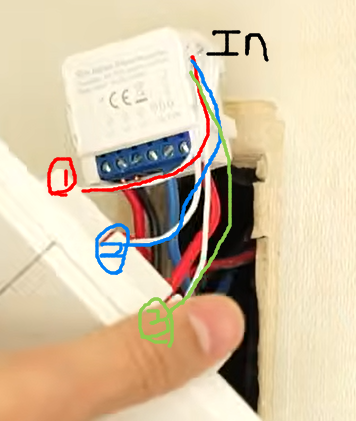

# IOT 배선 만들기(스마트 릴레이 모듈 사용)

---

>[유튜브 조명꾼 참고](https://www.youtube.com/watch?v=VtbE32UkTwI&t=50s)

## 필요 개념 

-  **모멘터리 스위치 (Momentary Switch)**
  - IOT 스위치는 누르는 동안만 접점 연결되는(손 떼면 원래 위치로 돌아옴) 초인종, 엘리베이터 버튼 방식으로 동작해야 한다. 
- 소비전력 계산
  - 솔레아 005 다운라이트 : 5W ~ 7W 
- 중성선 유무
  - 중성선 없으면 미세 전류가 L1,L2,L3 로 흘러들어갈 수 있음
  - 이때 잔여 발광이 미세하게 생기는 문제가 발생함. 
  - 해결방법
    1. 중성선 있는 스마트 릴레이 모듈 사용 
    2. SMPS 방식 LED 사용 ( LED 중 고급형임 ) -> 나의 경우엔 다운라이트 솔레아 005, 뤼네브 002 둘다 SMPS 방식이였음
- 네트워크 연결 
  - 3구 스위치 중 1개 (예를들어 간접등) 만 스마트 릴레이 모듈 지정 가능 ( 스마트 릴레이 모듈 3개짜리 하면 비싸지기 때문에 )

## 스마트 릴레이 모듈

- 전기를 제어할 수 있도록 도와주는 모듈 단자 
- 나같은경우는 zigbee 방식을 지원하는 "**AVATTO Tuya ZigBee 스마트 라이트 스위치 3Gang Module**" 를 사용했다. 
  - 검색어 : **AVATTO Zigbee Tuya ZWSM16**
  - [알리익스프레스 - AVATTO Tuya Zigbee](https://ko.aliexpress.com/item/1005006832397623.html?spm=a2g0o.order_list.order_list_main.42.6287140fIemPZk&gatewayAdapt=glo2kor)
  - 중성선 X : ZWSM16-1 -> AVATTO Tuya ZigBee no Neutral wired
  - 중성선 O : ZWSM16-W1 -> AVATTO Tuya Zigbee With Neutral
  - '중성선(Neutral) 없음' 방식은 한국의 일반적인 아파트 스위치 박스(중성선 없이 핫선과 스위치선만 들어와 있는 환경)에서도 별도의 배선 공사 없이 바로 설치할 수 있다는 것이 큰 특징

### 1. 단자별 역할 (L, L1, L2, L3, COM)

- 핫선 - **L (Line / Live): 전원 입력**

  - 분전함(차단기)에서 벽면 스위치 박스로 들어온 **메인 전원선(핫선)**을 연결
  - 모듈이 스스로 작동하기 위한 전력을 공급받고, 각 조명으로 보내줄 전기가 대기하는 입구이다 .

- 조명선 - **L1, L2, L3 (Load 1, 2, 3): 조명 출력**

  - 각각 **1번, 2번, 3번 조명**으로 올라가는 선들을 연결합니다.
  - 모듈 내부의 릴레이가 '스위치' 역할을 하여, `L` 단자로 들어온 전기를 각 전등으로 보낼지 말지를 결정하는 출구

- 물리 스위치 신호선 - **COM (Common): 스위치 신호 공통선**

  - 벽면에 붙어 있는 **기존 수동 스위치**들과 통신하기 위한 단자

  - 3구 수동 스위치 뒷면을 보면 각 스위치 버튼마다 단자가 2개씩있는데 **각 스위치 버튼의 한쪽 단자들**을 하나로 묶어 이 `COM` 단자에 연결한다. 

  - 즉, 사람이 스위치 누른 물리 신호를 이용해 전등을 켜고 끌수 있게 해줌 ( 이거 안하면 물리버튼 동작 X, Zigbee 신호로 조명은 킬 수 있음 )

    

- 물리 스위치 신호선 : IN 

  - 모듈의 `S1, S2, S3` 단자를 스위치 단자와 연결 

  - 모듈은 `COM` 단자와 `S` 단자 사이의 전기적 신호 변화를 감지하여 "벽 스위치가 눌렸구나"라는 것을 인식하고 조명을 켠다 .

    

## 2.  모멘터리 스위치로 변경 

- 스위치 중 토글 스위치에 스프링 연결하면 모멘터리 스위치로 만들 수 있다. 
- 모멘터리 사용 이유 
  - 네트워크로 불 켜짐 명령 내렸을 때 **물리 스위치는 그대로 있는 상태가 발생** 
  - 즉, 불은 켜졌지만 스위치 적으로 봤을 때는 꺼져있는 상태.
  - 따라서 토글이 아닌 눌렀나 나오는 식으로 진행해야한다. 
- 솔레아 005 다운라이트라면?
  - 5~7W LED면 1~2개만 연결하면 잔광 가능성 있음

### 스마트 릴레이 모듈 5종 비교표

- **노뉴트럴(중성선 미필수)** 방식의 ZigBee 3구 모듈 5가지를 성능과 가격 위주로 비교
- 3구 모델은 다른 브랜드보다 약간 두꺼울 수 있어 배선 정리가 중요합니다.

| **제품명**               | **프로토콜** | **특징**                      | **가격대 (알리 기준)** | **추천 포인트**     |
| ------------------------ | ------------ | ----------------------------- | ---------------------- | ------------------- |
| **1. Avatto (ZWSM16)**   | ZigBee 3.0   | 가장 대중적, 검증된 호환성    | 약 $12~15              | 실패 없는 표준 선택 |
| **2. Moes (MS-104)**     | ZigBee 3.0   | 빌드 퀄리티 및 앱 UI 우수     | 약 $14~18              | 브랜드 신뢰도 중시  |
| **3. Aubess (Mini)**     | ZigBee 3.0   | 초소형 사이즈, 가성비 최강    | 약 $8~11               | 좁은 스위치 박스용  |
| **4. Zemismart (ZM-RM)** | ZigBee 3.0   | 반응 속도 및 페어링 안정성    | 약 $15~20              | 하이엔드급 성능     |
| **5. Girier (JR-ZWS01)** | ZigBee 3.0   | 과부하 보호 등 안전 기능 특화 | 약 $10~13              |                     |