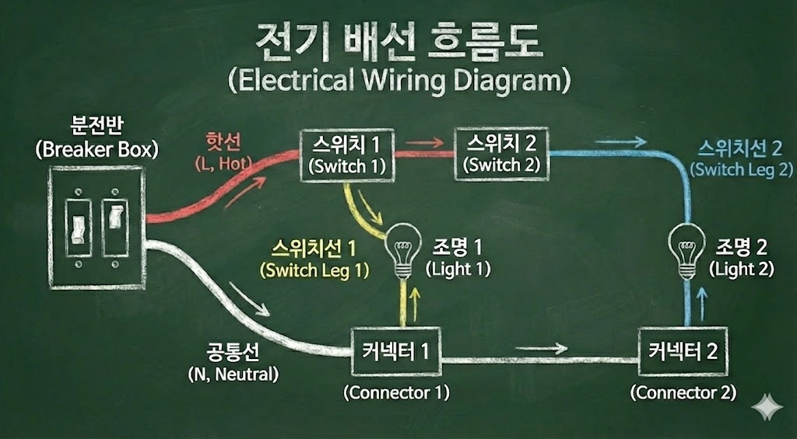

# 전등 회로 흐름 정리 

---

## 학습 개기

- 인테리어를 알아보다가 문뜩 집의 전기 배선의 구조가 궁금해졌다. 
- 분명 분전함에서 나오는 전기 선은 몇가닥 안되는데 이 선들로 콘센트, 조명 등등 모든 전기가 제공되는게 이해되지 않아 학습해보게 되었다. 

## 전기 배선 흐름도

## 전선 색

- 대체로 사용되는 전선색이 있다. 하지만 색이 제한적이기 때문에 여러 스위치선을 추가한다면 혼용되어 사용될 수 있으니 주의가 필요하다. 

1. 빨간색
   - 핫선으로, 전기가 직접 이동하는 선 ( 스위치 및 콘센트에 직접 연결됨 )
2. 초록색
   - 누전용 선으로, 접지에 사용됨 
3. 흰색
   - 뉴트럴 선으로, 중성선 및 공통선이라고 함( 조명들과 직접 연결됨 )

## 직렬/병렬

1. 직렬
   - 빨간색 핫선(L) 은 직렬로 연결된다.
   - 즉, 하나의 선으로 모두 연결되야한다 ( 선을 점프해서 연결해야함 ) -> 커넥터로 분기 하면 안됨 
2. 병렬
   - 중성선(N) 은 병렬로 연결된다. 
   - 즉, 하나의 선이 나오지만 커넥터를 이용해 여러 분기 처리가 가능하다. 

### 전등 회로 흐름 (분전반 → 스위치 → 조명)

- 흐름은 크게 **[에너지 공급로]**와 **[에너지 회수로]**로 나뉜다. 

#### 1. 에너지 공급 및 제어 (핫선 & 스위치선)

- **공급 (Hot):** 분전반에서 시작된 **220V** 전원선이 **스위치 1번**으로 들어갑니다.
- **점프 (Bridge):** 스위치 1번의 전원 단자(핫선)에서 **스위치 2번**의 전원 단자로 선을 연결. (이로써 두 스위치 모두 전기를 쓸 준비가 됨.)
- **출력 (Switch Leg):** 각 스위치를 켜면, 연결된 **스위치선**을 통해 해당 조명으로 전기가 전달

#### 2. 에너지 회수 (공통선)

- **복귀 (Neutral):** 분전반에서 나온 공통선은 스위치를 거치지 않고 바로 조명으로 간다. 
- **병렬 연결 (Connector):** 첫 번째 조명 위치의 **커넥터**에서 선을 나눠 하나는 현재 조명에 꽂고, 다른 하나는 다음 조명의 커넥터로 보내는 방식으로 '줄줄이' 연결된다. 

### 한눈에 보는 배선 구조표

| **구분**    | **명칭**       | **경로**                                 | **핵심 역할**             |
| ----------- | -------------- | ---------------------------------------- | ------------------------- |
| **가는 길** | **핫선 (L)**   | 분전반 -> 스위치 1 -> 스위치 2           | 전력 공급 (항상 살아있음) |
| **제어문**  | **스위치선**   | 스위치 -> 각 조명                        | 전등 On/Off 결정          |
| **오는 길** | **공통선 (N)** | 분전반 -> 조명 1 커넥터 -> 조명 2 커넥터 | 회로 완성 (귀갓길)        |

## 접지선 ( G )

- 역할
  - 누전 시 전류를 땅으로 즉시 배출하는 역할 (대체로 초록색 선 사용)
- 경로
  - 분전반에서 출발한 녹색 선이 각 방의 콘센트 박스와 조명 박스로 뻗어 나감
- 핵심기능 
  - 차단기(ELB)가 즉시 내려가도록 유도
- 연결 위치
  - 조명의 금속 몸체 또는 콘센트 접지 단자