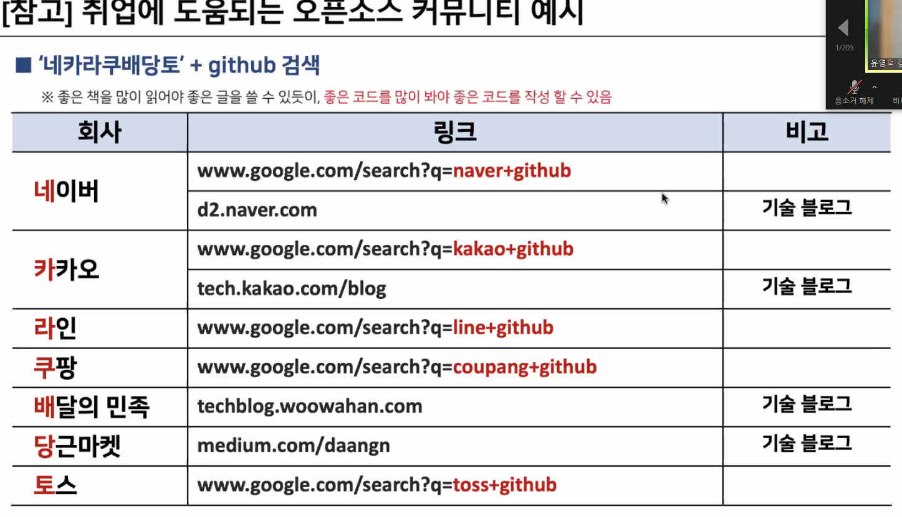

# 코딩테스트 및 CS  기술면접 준비 

---

# 코딩테스트

1. 코딩 테스트란?
   - 지원자에게 직접 소스 코드를 작성하게 하여 지원자의 문제해결 능력과 코딩 실무 능력을 평가 . 
2. 코딩 테스트를 잘하기 위해 필요한 능력
   1. 문제 분석 능력 : 주어진 문제를 빠른 시간 내에 정확히 이해하고 분석하는 능력
   2. 지식 활용 능력 : CS 기반 지식( 자료구조, 알고리즘 ) 에 대한 정확한 개념 정리와 적절한 활용 능력
   3. 구조 설계 능력 : 
   4. 코드 구현 능력
   5. 코드 설명 능력
3. 코딩 테스트 종류
   1. 온라인 코딩 테스트
      - 코딩 테스트 사이트와 협약을 통해 진행 
      - 면접관이 실행됐던 코드와 히스토리를 확인할 수 있다. 
      - 수정 및 테스트를 할수 있다. 
   2. 손 코딩 테스트
      - 종이제 직접 소스 코드를 작성 
      - 면접관이 손코딩을 보고 면접 시작
      - 문법이나 구문을 오류 없이 작성하기 쉽지 않음 
      - 깔끔하고 정갈한 글씨체로 소스 코드를 작성하는 연습도 필요 
   3. 화이트 보드 라이브 손코딩 테스트 
      - 면접관과 직접 대화를 하면서 코딩 테스트 진행 
      - 앞에서 문제 풀이 과정을 라이브 하게 보여주어야 하기때문에 많은 연습이 필요 
4. 코딩 테스트 하는 이유 
   - 코딩 테스트 점수와 실제 코딩 실력의 연관성은 이론적으로 비례한다. 
   - 하지만 일정 수준 이상이 되면 코딩 실력 자체와는 괴리감이 있을 수 있다. 
   - 상관관계는 있지만 절대적이라고 생각하지는 않음 
   - 실력 있는 개발자를 선별하기 위한 차선의 도구이기 때문에 진행한다. 

### 코딩 테스트 준비 전략 

1. ( 가 ) 유형 : 실제 코딩 실력은 뛰어나지만 코딩 테스트 결과가 좋지 않은 경우 
   - 코딩 테스트 주요 출제 패턴과 유형에 익숙해지도록 다양한 패턴을 많이 익히고 기출 유형을 많이 접해보는 것이 중요
   - 코딩 테스트에서 자주 활용되는 알고리즘, 자료구조 학습이 필요 
2. ( 나 ) 유형 : 실제 코딩 실력도 부족하고, 코딩 테스트 결과도 좋지 않을 경우 
   - 본인이 가장 자신 있는 프로그래밍 언어를 선택하여 기본적인 문법과 함수 사용 에 대한 숙달 필요 
   - 프로그래밍 구현 능력 위주로 연습을 해보는 것을 추천 
3. ( 다 ) 유형 : 실제 코딩 실력은 부족하지만 코딩 테스트 결과는 좋은 경우 
   - 많은 사람들이 시도할 만한 방법이나 알고리즘을 탈피해서 좀 더 창의적이고 새로운 방식으로 구현해보는 연습 필요 
   - 코딩 테스트 훈련을 통해서 익힌 알고리즘 및 자료 구조 개념을 실제 프로젝트에 적용하여 성능 측정 및 개선을 시도 
4. ( 라 ) 유형 : 실제 코딩 실력도 뛰어나고 코딩 테스트 점수도 좋은 경우 
   - 결과를 잘 설명하기 위한 인터뷰 연습이 중요하다 .
   - 공격적인 질문이나 비판적인 의견에 감정적으로 대응하지 않도록 마든드 컨트롤 필요 
   - 실력은 뛰어나지만 협업하기 어려운 개발자는 아닐지에 대한 우려를 가지고 질문이 들어올 수 있음 
   - 커뮤니케이션 연습 필요 

### 코딩 테스트 Tip

1. 온라인 코딩 사이트를 적극 활용하기 

   - 백준

   - 프로그래머스
   - 해커랭크
   - 정올
   - 코딩도장
   - 삼성 SW Expert Academy
   - 백준, 프로그래머스, 해커랭크 이 3가지 사이트는 기업에서 협업으로 진행할 떄 사용되는 사이트이다. 
   - 따라서 이 사이트의 툴을 한번 다뤄보는것이 좋다. 

2. 쉬운 문제부터 하나씩 공략하기 

   - 코딩 테스트 사이트에서 가장 쉬운 문제부터 공략하기 
     - 쉬운 문제는 반드시 1 ~ 2 개 나오기 때문에 절대 놓치면 안됨
   - 본인이 어떤 부분이 약한지 파악하여 해당 부분을 집중 연습 
     - 반복적인 패턴과 유형을 접해 이해 시간을 단축 
     - 정답지를 보면서 분석아여 완벽하게 이해 
     - 특히 알고리즘과 자료구조에 대한 지식이 부족한 경우 이럴 수 있기 때문에 cs 이론 학습 필요 
     - 많은 문제를 풀기보다 **하나를 풀더라도 제대로 완벽하게 이해** 하고 내재화 할 수 있어야 함 
   - 한 문제를 정답지를 보고 이해하고 내 방식으로 풀어내는 것이 좋다. 

3. 내가 지원하는 회사의 출제 난이도와 출제 경향을 파악하라 

   - 내가 목표하고 있는 회사의 코딩 테스트 난이도와 출제 패턴을 분석하기 
   - 금융권이나 SI 회사를 지원하는 경우에어는 반드시 SQL 코딩 테스트 준비 필요 
     - SQL 문은 거저주는 문제이기 때문에 연습 필요 
   - 네이버 , 라인 등은 탐색 알고리즘 및 문자열 검색 및 정렬 문제 자주 출제 

4. 코딩 언어 선택

   - 회사에서 쓰이는 언어나 입사 후 많이 쓰일 언어를 사용하는게 좋음
   - 가신이 가장 자신있는 언어로 해도 됨 

---

## CS 기술면접 준비 전략 

1. CS 기술 면접이란 ? 
   - 지원자의 직무 수행 능력을 평가하기 위하여 기술과 직무 중심으로 지원자를 평가하는 면접 
   - 앞으로 얼마나 **성장가능성 이 있는지** 검증하는 것이 목표이다. 
2. 금융권의 PT면접 예시 
   - 우리 회사가 테크핀 업체 및 인터넷 뱅크 대비 경쟁 우위를 차지하기 위해서는 어떠한 전략이 필요할까요?
     - 전통적인 금융기업이 가지고 있는 경쟁 우위를 설명 
       - MZ세대만이 아닌 실버 세대를 포함한 전 세대에 걸친 많은 수의 고객을 생각 
     - 인터넷 뱅크에서 검증된 전략과 혁신을 어떻게 가지고 올 것인지를 설명 

### CS 기술면접 준비 방법 

1. 희망 직무, 업종 설정 
   - 본인이 정말로 잘 할 수 있는 직무와 매력을 느끼고 관심이 많은 업종을 구체적으로 정하는것이 좋음 
2. 타켓 회사와 사전 조사 
   - 입사를 희망하는 목표 회사에 대해서 최대한 많은 정보를 찾고 열심히 분석 하기 
   - 해당 서비스에 구현된 기술 스택 파악 및 접목 가능한 최신 기술에 대한 고민과 생각 정리 
3. 입사 지원서 및 포트폴리오 정리 
   - 입사를 희망하는 타겟 기업, 직무에 맞는 이력사항, 포트폴리오 정리 
   - 지원 동기, 프로젝트 목적과 팀원 구성 및 역할 등 명확하게 정리 
   - 사용해본 기술 스택에 대한 정리. ( **선택이유와 체감한 장단점 정리** )
4. CS 지식 , 용어 정리 
   - 모든 분야를 깊이 있게 알 필요는 없지만, 적어도 한 분야 만큼은 충분히 깊이 있는 지식을 갖추기 
   - CS 기초 지식 분야 : 자료구조, 알고리즘, 데이터베이스, 프로그래밍 언어, 네트워크, 보안 등 
   - 사용한 기술에 대한 지식은 필요 
5. 최신 기술 동향 파악 
   - 지원하는 회사와 관계가 있는 최신 기술 동향이나 흐름에 대해서는 반드시 파악하기 
   - 중견 기업 이상의 경우 **최신 기술 트렌드에 질문은 빠짐없이 나옴 **
   - 한 분야를 선정하여 깊이 있게 정리하는 것이 더 효과적
6. 코드 리뷰 연습
   - 코드는 전체 구조를 먼저 생각한 후 세부 내용을 작성하고 결과를 리뷰하는 연습하기 

### CS 기술면접 준비 Tip

1. 직무 면접에도 단골 질문이 있다. 

   - 입사 이후 지원 하고 싶은 분야 

2. 다른 지원자 대비 차별화된 전략되 필요 

   - 지원하는 회사에서 공모전 개최한다면 꾸준히 참가 
   - 관심있는 분야에 대해서 기술 블로그나 커뮤니티를 개설하여 꾸준히 활동하고 있음을 증명

3. 자신이 관심있는 분야의 오픈소스 활동 추천 

   - 해당 커뮤니티에서 컨트리뷰터로 기여를 하게 된다면 큰 어필이 됨 

4. 취업에 도움되는 오픈소스 커뮤니티 예시 

   

### CS 기본 지식 및 개념에 대한 질문 예시

1. ios의 생명주기에 대해 설명
2. Python의 GIL 에 대해 설명
3. JAVA에서 Garbage Collection이 필요한 이유 설명
4. 컴파일러 언어와 인터프리터 언어의 차이 
5. Vue, React 프레임 워크 각각의 장단점 설명
6. 어떤 서비스를 만드려고 하는데 어떠한 프레임워크를 채택하는 것이 좋을까요
7. 머신러닝에 사용했던 학습 데이터는 어디서 구하였는지. 
8. 머신러닝 알고리즘 어떤걸 사용했고 왜 사용했는지 

### IT업무에 전공이 중요한지 

- 예전에는 전문적인 기관이 대학밖에 없었음
  - 생각보다 다양하고 넓은 지식이 필요했다. 
  - 빠른 시간내에 실무에 투입이 가능해야 했다. 
- 지금은 다른곳에서 얼마든지 공부할 수 있게 되었다. 
  - IT 가 전문분야로 나뉘면서 세분화 된 영역의 전문성이 중요시 됨 
  - 프레임워크 로 인해 접근성이 낮아졌다. 
  - 다른 산업에 대한 이해와 소통 능력도 중요해짐 
  - 본인 전공 관련 분야에 IT 기술을 적용한다면 희소성도 크고 차별화된 본인만의 역량이 될 수 있음 

### 개발자의 적성과 성과에 따른 유형 4가지 

- 성과와 적성이라는 두 축을 가지고 본인이 속한 어느 유형에 속해 있는지 알아야함 
- 성과 : 객관적인 근거 - 증명 가능한 지표
- 적성 : 코딩이라는 일에 대한 소질과 적성 그리고 흥미 - 코딩의 즐거움 

1. D 유형 : 코딩 실력을 증명할 만한 구체적인 성과도 있고 코딩이 적성에도 맞음 
   - 짧은 기간 동안 괄목한 만한 성장과 의미 있는 성과가 있었음을 어필 
   - 집중력과 끈기를 가지고 해낼 수 있었음을 추가로 설명 
   - 프로젝트 성과가 자신의 역량이 얼마였는지 꼬리질문이 들어올 수 있음 
2. C 유형 : 코딩 실력을 증명할 만한 구체적인 성과는 없지만 확실히 코딩이 재밌고 적성에 맞음 
   - 유의미한 성과를 단 하나라도 만들어 내는 것이 중요 
3. B 유형 : 코딩 실력을 증명할 만한 구체적인 성과도 없지만 코딩이 적성에 맞는지도 모름 
   - 전반적인 CS 기본 지식을 꼼꼼하게 점검하고 준비할 필요 있음 
   - IT 분야를 찾기 위한 탐색 과정과 노력 필요 
4. A 유형 : 코딩 실력을 증명할만한 구체적인 성과는 있지만 코딩이 적성에 맞는지 잘 모르는 경우 
   - 본인의 것으로 내제화 필요
   - 프로젝트 성과가 본인의 노력에 의한 것인지 냉정한 분석과 고민 필요 
   - 연속적인 성과가 나온다면 확실히 재능이 있는 것이므로 본인이 성과를 낼 수 있는 곳을 찾아가는 것이 좋음 

---

## Q & A

- 자격증을 따는 것 보다는 기본 지식을 쌓기 위함을 인지해야 함
  - 자격증 자체만으로 보다는 기본 지식 ( 정처기 점수가 90점 이상 ) 이라면 의미있음 
- 성장 가능성이 있는 곳이 힘들 수 있겠지만 실력이 좋은사람이 많을 수 있고 내 실력이 좋아질 수 있음
  - 사람들이 끌어줄 수 있음 
- 만약 취업한다면 이력서 들고 내가 찾아다니는 일이 없게 하는게 좋음
  - 같이 일했던 사람들이 추천으로 대리고 올 수 있도록 만들어야함 
- 코딩 테스트를 많이 풀기 보다는 해당 패턴을 익히고 자신의 것으로 만드는 것이 좋음 
  - 더 좋은 풀이를 찾아가면서 나의 코딩과 좋은 코딩의 사이를 좁혀가는 것이 좋다. 
- 코딩 테스트에 필요한 알고리즘 지식들을 미리 공부하는 것도 도움이 된다. 
- 코딩 테스트에서는 간결하고 창의적 코드면 좋을 수 있다. 
  - 다른 사람이 짜놓은 좋은 코드를 보면서 익혀가는 것이 좋다. 

