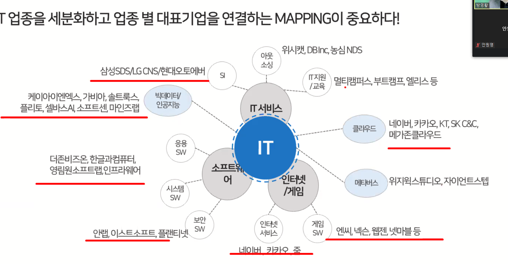
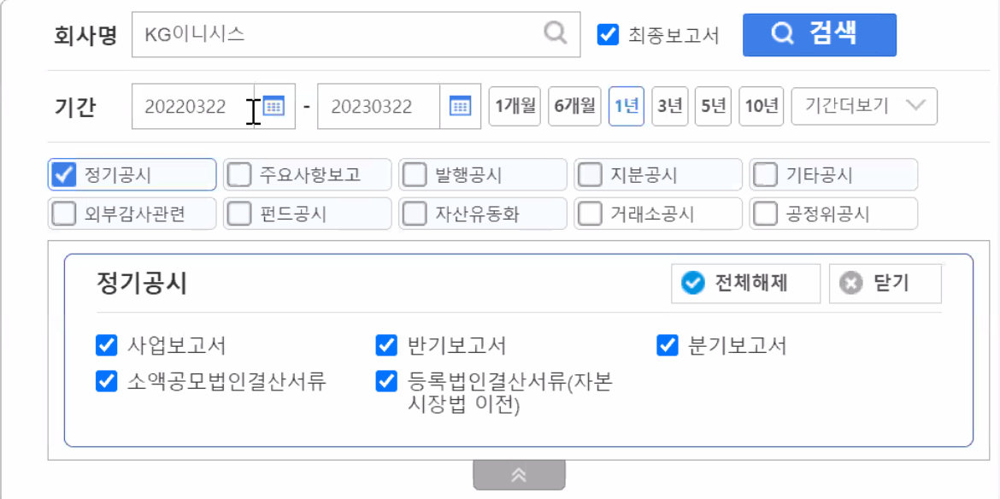
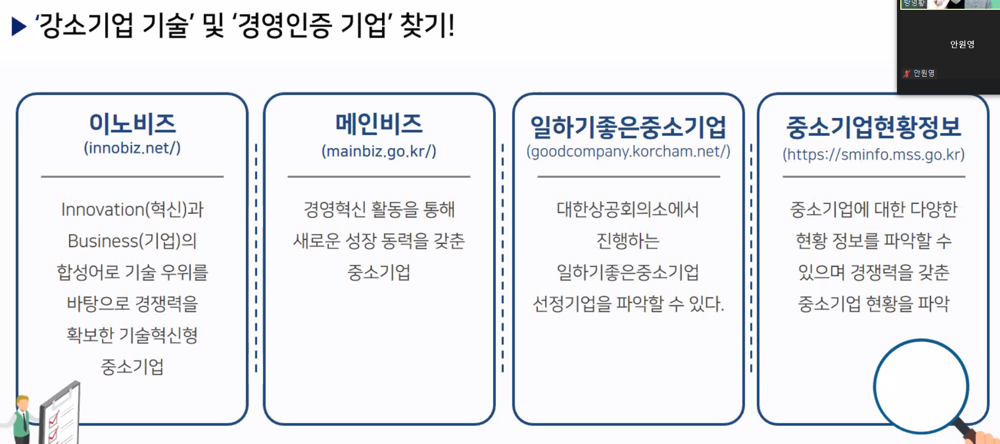

# 타겟기업 분석 특강

---

>기업을 분석하는 방법을 알아본다. 

## 1. 산업과 기업분석

### 산업에 대한 분석

- 산업의 트렌드에 대해 이해해야 기업의 요구사항을 파악할 수 있다. 
- IT 는 지식집약형 업종이다. 
  - 지식이 없으면 취업하기 힘들다. 
  - 기업의 **연구개발비**와 **투자비용**을 잘 봐야한다.
  - 지식의 변화가 빠른 분야. 따라잡지 못하면 뒤쳐질 수 있는 업종
- 기계공학이 경기순환형 업종이다.
  - 스마트시티와 스마트 팜, 스마트 물류 쪽이 속한다.  
  - 경기가 좋지 않을 때 버틸 수 있는 기업을 골라야한다. 
  - 스마트팩토리도 포함됨 
- 중소기업볼 때 **매출액과 영업이익의 증가**가 가장 중요함 
  - 스타트업과 금융계열은 **영업이익 거의다 마이너스**임 ( 성장가능성을 보고 지원해야 함 , 기술특허와 얼마 투자받았는지가 중요함 ) 
- 투자 없다고 해서 안좋은 기업 아님
  - 자본금이 있어서 투자 불필요 할 수 있기 때문에 

### IT 기업 추천 

---

## 2. 기업분석 방법 ( 상장기업, 알짜기업)

### 기업분석 활용 주요 사이트

1. DART - 핵심정보, 사업 , 재무
2. 네이버 금융 - 핵심정보, 사업 , 재무
3. NICE 기업정보 - 핵심정보, 사업 , 재무
4. 워크넷 - 채용정보 - 통합기업정보 
5. 한경컨센서스 - 핵심정보, 사업 , 재무
6. 기업 홈페이지 
7. 포털 검색 - 기업 정보 

### 기업정보 조사

- 최신 뉴스
- 재무정보
- 주력사업

### 재무정보 

- 네이버 증권에서 검색해보기 - 단, 상장되어있는 회사만 올라옴 
- 네이버 증권에 있는 **DART창의 '정기공시'** 만 보기 
  - **사업의 내용 탭**
    - 연구개발비 검색 -> 2% 이상되는곳이 좋은곳임 ( 진짜 좋은곳은 5% 이상 )
    - 임원 및 직원 등의 현황 -> 특수관계인 ( 가족 기업인것을 알 수 있음 ) -> 남 여 비율, 평균 근속연수 보기 ( 근속연수는 신입 많이 뽑으면 줄어든다.  ) -> **근속연수 5년이상**이 좋은기업임 
  - 종목분석 탭 
    - 재무재표 확인가능 -> **매출액**( **3년 평균 15% 이상**인 기업만 성장하는 기업임. ) -> **영업이익이** 가장중요 ( **올해 이익을 사원수로 나누기** -> 나눠서 나온 값이 한 사람당 더 벌어오는 이익임 -> **IT는 5000 이상**이면 좋음 )
    - 중소는 2000 이상이면 좋음 
    - 부채비율 (200% 이하면 됨) 
    - \+ \- \-  되는곳이 좋은곳임 
  - **재무분석 탭** 
    - **급여 증가율** 볼 수 있음 -> **급여**가 계속 오르는곳이 좋음 -> **복리후생비**도 중요 

### Naver 의 국내증시 

- 업종 에서 기업보기 
- 테마 -> IOT 보기 

### 강소기업 찾는 사이트 

- **이노비즈**
  - **기술력 공식적**으로 인증받은 기업 볼 수 있음
  - 사이트 메인포털 잘 꾸며놓은 기업이 좋은 기업
    - 올드한 스타일의 메인포털은 피하기 
  - 중소기업이라 상장이 안되어있어 판단이 어려울 수 있다는 단점이 있다. ( 워크넷에서 찾아보면 됨 )
  - 워크넷 -> 채용정보 -> 통합기업정보 
    - 중소기업이 50명 넘어가면 좋은거임 
- **일하기좋은중소기업**
  - 업종별 -> IT 웹통신 -> 업종별 기업리스트 
  - 기업에대한 재무현황, 재무비율 볼 수 있음 
- **중소기업현황시스템**
  - 중소기업현황 -> 기업통계 
  - 중소기업에 대한 정보와 매출현황, 재무정보를 볼 수 있다. 
- **thevc.kr** 
  - **스타트업 투자받은 기업** 찾아볼 수 있는 사이트 
  - 해당 기업의 뉴스까지 다 볼 수 있음 
  - 최근 투자 단계 보기 
    - Series A ( 스타트업 중 좋은 곳 ) 이상 보기 -> 10~ 100억 사이 투자받음
    - Series B( 유튜브 같은곳에 광고 마케팅 하는 기업 )
    - Series C ( 연애인 이용할정도의 마케팅 하는 기업 )
    - 특허가 많은 곳일수록 좋음  (중소는 거의 없는 기업이 많음 )
    - 유사회사도 볼 수 있음 
  - 회사명과 서비스 명 을 볼 수 있음 
  - **투자자들 중 팁스** 나 정부 관련기업이면 좋은곳임 
- 스타트업얼라이언트
  - 스타트업 맵-> 카드로 보기 
  - **분야별 대표적인 기업**들을 한눈에 볼 수 있음 

---

## 3. 기업분석 활용법

### 취업준비 방법

- 1년에 50개정도 지원해보기 
- 기업분석을 기반으로 자소서 작성하고 기출면접질문 답변을 준비한다. 

### 외국계 기업 지원 방법 

- 피플앤잡
- 잡코리아, 사람인
- 월드잡 플러스 
- 링크드인 채용공고 올리기 
- 외국계 희망 기업 채용 사이트 

### 추천 기업 

- 코난테크놀로지 
- 누리 
- 마이다스 IT ( 건설 SW )
- 아이비스 ( 보안용 CCTV )
- 모아데이터 
- 마인즈랩
- 링인터랙티브
- 스타트업
  - 시큐아이 ( 보안업체 )
  - 애즈위메이크 ( 유통 플랫폼, 물류, 마트 )
  - 베리타스자산대부 ( 금융 )
  - 티벨 ( 테스트를 통해 품질 검수하는 기업 )
  - 리디 
- 티라유텍 ( 스마트팩토리 )
- 레드윗
- 네오사피엔스
- 펄어비스 ( 게임 ) -> 복지 좋음 