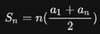

# < Level 1 > 

# 두 정수사이의 합 

> 등차수열 합 공식 사용 

---

## 문제설명 

- 두 정수 a, b가 주어졌을 때 a와 b 사이에 속한 모든 정수의 합을 리턴하는 함수, solution을 완성하세요.
  예를 들어 a = 3, b = 5인 경우, 3 + 4 + 5 = 12이므로 12를 리턴합니다.


## 제한사항 

- a와 b가 같은 경우는 둘 중 아무 수나 리턴하세요.
- a와 b는 -10,000,000 이상 10,000,000 이하인 정수입니다.
- a와 b의 대소관계는 정해져있지 않습니다.

## 입출력 예

| a    | b    | return |
| ---- | ---- | ------ |
| 3    | 5    | 12     |
| 3    | 3    | 3      |
| 5    | 3    | 12     |

## 풀이 

1. 내가 푼 풀이 

   ```java
   public long solution(int a, int b) {
       long answer = 0;
       long big = 0;
       long small = 0;
       double middle = 0;
   
       if( a == b ){
           return a;
       }
   
       big = (a > b) ? a : b;
       small = (a > b) ? b : a;
   
       // (a-b) + 1 * (a+b)
       answer = (((big - small) + 1) * (big + small) )/ 2;
   
       return answer;
   }
   ```

2. 가장 좋은 풀이 

   ```java
   public long solution(int a, int b) {
       return sumAtoB(Math.min(a, b), Math.max(b, a));
   }
   
   private long sumAtoB(long a, long b) {
       return (b - a + 1) * (a + b) / 2;
   }
   ```

3. 일반적인 풀이 

   ```java
   public long solution(int a, int b) {
       long answer = 0;
       int temp = 0;
       if(a > b) {
           temp = a;
           a = b;
           b = temp;
       }
       for(int i = a; i <= b; i++) {
           answer += i;
       }
   
       return answer;
   }
   ```

4. 특이한 풀이 

   ```java
   public long solution(int a, int b) {
       long answer = 0;
       for (int i = ((a < b) ? a : b); i <= ((a < b) ? b : a); i++) 
           answer += i;
   
       return answer;
   }
   ```

   


---

## 사용된 개념

1. 등차수열의 합 공식 

   

   - a1 : 첫번째 수 , an : 마지막 수 , n : 전체항의 수 
   - (((a - b) + 1) * (a + b)) / 2
   - 공식을 보면 등차수열의 합은 첫째항과 끝항의 평균값을 전체 항의 개수로 곱한 값과 같다는 사실을 알 수 있습니다
