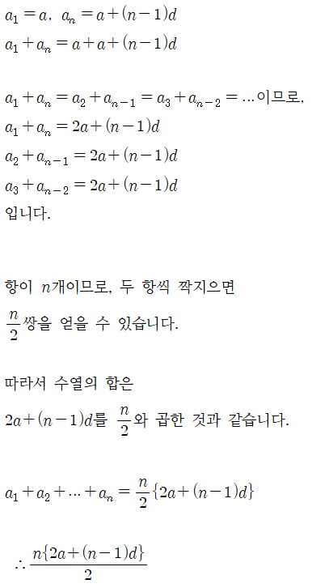

# < Level 2 > 

# 숫자의 표현 

> [참고사이트 ](https://mathbang.net/m/607)
>
> [참고사이트](https://calcproject.tistory.com/m/448)

---

## 문제설명 

- Finn은 요즘 수학공부에 빠져 있습니다. 수학 공부를 하던 Finn은 자연수 n을 연속한 자연수들로 표현 하는 방법이 여러개라는 사실을 알게 되었습니다. 예를들어 15는 다음과 같이 4가지로 표현 할 수 있습니다.

  - 1 + 2 + 3 + 4 + 5 = 15
  - 4 + 5 + 6 = 15
  - 7 + 8 = 15
  - 15 = 15

  자연수 n이 매개변수로 주어질 때, 연속된 자연수들로 n을 표현하는 방법의 수를 return하는 solution를 완성해주세요.


## 제한사항 

- n은 10,000 이하의 자연수 입니다.

## 입출력 예

| n    | result |
| ---- | ------ |
| 15   | 4      |

## 풀이 

1. 등차수열 이용 풀이 

   ```java
   for(int i = 1; n-((i*(i-1))/2) > 0; i++){
   
       if((n-((i*(i-1))/2))% i == 0){
           answer++;
       }            
   
   }
   ```

2. 노가다 풀이 

   ```java
   class Solution {
       public int solution(int n) {
           int answer =0;
           int inum=0;
           int add =0;
           for(int i=1;i<=n;i++){
               inum = i;
               add = 0;
               while (true){
                   add+=inum;
                   if(add==n){
                       answer++;
                       break;
                   }else if(add>n){
                       break;
                   }
                   inum++;
               }
           }
           return answer;
       }
   }
   ```

3. 노가다 풀이 2

   ```java
   for(int fNum=1; fNum <= num; fNum++){
         int chkNum = 0;
           for(int sNum=fNum; sNum <=num; sNum++){
            chkNum = chkNum + sNum;
   
            if(chkNum == num){
                answer++;
                break;
            }else if(chkNum > num){
                break;
            }
         }
         //chkNum = 0;
       }
   
   ```

   


---

## 사용된 개념

### 등차수열

1. 정의 

   - 예를들어 1, 2, 3, 4, 5, 6, …는 자연수를 늘어놓은 수열이 있다. 제1항은 1이고 제2항부터는 바로 앞의 항보다 1이 더 크다. 2, 4, 6, 8, 10, …은 짝수를 늘어놓은 수열인데 제1항은 2고 제2항부터는 바로 앞의 항보다 2가 크다. 이처럼 첫째항에 일정한 수를 더해서 얻은 항으로 이루어진 수열을 **등차수열**이라고 하고 더해지는 일정한 수를 **공차**라고 한다.
   - 따라서 제 1항이 공차만큼 일정한 크기로 늘어나는 자여수의 집합을 등차수열이라고 한다. 

2. 표현식

   - a : 제 1항
   - d : 공차
   - n : 항의 갯수 

3. 공식

   - 공차(d) : n - (n-1)

   - 일반항 :  n = a + (n-1)d

   - 등차수열의 합 

     
