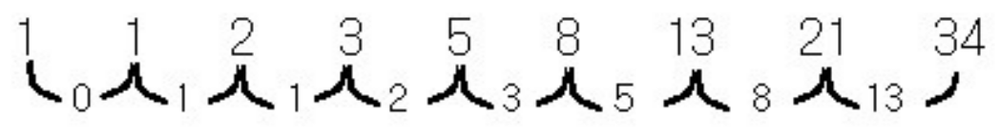

# < Level 2 > 

# 피보나치 수 

> 사용 개념 간소화 

---

## 문제설명 

- 피보나치 수는 F(0) = 0, F(1) = 1일 때, 1 이상의 n에 대하여 F(n) = F(n-1) + F(n-2) 가 적용되는 수 입니다.

  예를들어

  - F(2) = F(0) + F(1) = 0 + 1 = 1
  - F(3) = F(1) + F(2) = 1 + 1 = 2
  - F(4) = F(2) + F(3) = 1 + 2 = 3
  - F(5) = F(3) + F(4) = 2 + 3 = 5

  와 같이 이어집니다.

  2 이상의 n이 입력되었을 때, n번째 피보나치 수를 1234567으로 나눈 나머지를 리턴하는 함수, solution을 완성해 주세요.


## 제한사항 

- n은 2 이상 100,000 이하인 자연수입니다.

## 입출력 예

| n    | return |
| ---- | ------ |
| 3    | 2      |
| 5    | 5      |

##### 입출력 예 설명

피보나치수는 0번째부터 0, 1, 1, 2, 3, 5, ... 와 같이 이어집니다.

## 풀이 

1. 내가 푼 풀이 

   ```java
   public int solution(int n) {
       int answer = 0;
       int result = 0;
       int first = 0; // F(0)
       int second = 1; // F(1)
   
       // 피보나치 
       for(int i=1; i <= n ; i++){
           first = second % 1234567;
           second = result % 1234567;
           result = first + second;
       }
   
       //System.out.println("result : " + result + " , first : " + first + " , second : " + second);
       answer =  result % 1234567;
       // result % 1234567 => (first + second) % 1234567 => (first % 1234567) + (second % 1234567)
   
       return answer;
   }
   ```


---

## 사용된 개념

### 피보나치 

1. 정의

   - 피보나치 수는 0과 1로 시작한다. 0번째 피보나치 수는 0이고, 1번째 피보나치 수는 1이다. 그 다음 2번째 부터는 바로 앞 두 피보나치 수의 합이 된다.

2. 예시 

   - n=17일때 까지 피보나치 수를 써보면 다음과 같다.

     0, 1, 1, 2, 3, 5, 8, 13, 21, 34, 55, 89, 144, 233, 377, 610, 987, 1597

     

     

3. 공식 

   - Fn = Fn-1 + Fn-2 (n ≥ 2)

4. 조심해야할 것 

   - 피보나치 수는 급격하게 증가되므로 정수의 범위에 신경써야한다. 
   - int일 경우 , -2,147,483,648 ~ 2,147,483,647까지의 값만을 표현할 수 있다.
   -  **( A % C ) + ( B % C) ) % C  = (A + B) % C**    의 성질을 만족한다. 범위를 맞추기위해 사용한다. 
   - 한줄요약: 문제에서 1234567로 나눈 나머지를 정답으로 내놓으라는 것은 문제를 꼰 것이 아니라 int 자료형의 범위 내에 항상 값이 있을 수 있도록 한 배려이며, 자료형의 크기에 제한이 있는 언어를 쓸 경우 (A + B) % C ≡ ( ( A % C ) + ( B % C) ) % C라는 성질을 이용해서 매번 계산 결과에 1234567으로 나눈 나머지를 대신 넣는 것으로 int 범위 내에 항상 값이 존재함을 보장할 수 있다.
