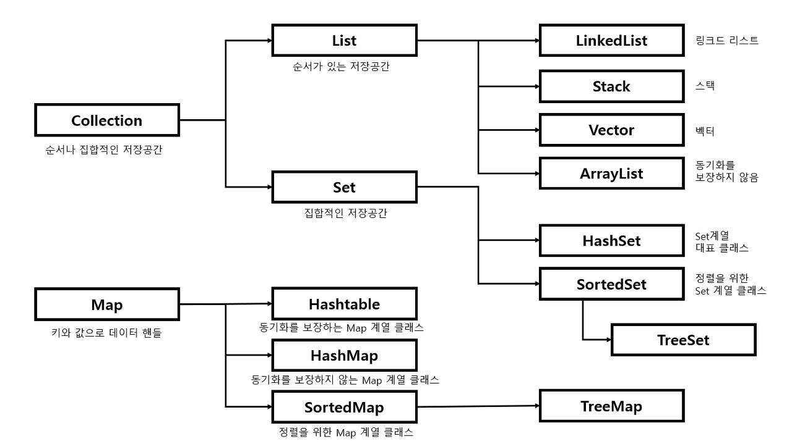

# < Level 1 > 

# 신고 결과 받기  ( KaKao )

> HashMap 개념 정리 

---

## 문제설명 

- 신입사원 무지는 게시판 불량 이용자를 신고하고 처리 결과를 메일로 발송하는 시스템을 개발하려 합니다. 무지가 개발하려는 시스템은 다음과 같습니다.
  - 각 유저는 한 번에 한 명의 유저를 신고할 수 있습니다.
    - 신고 횟수에 제한은 없습니다. 서로 다른 유저를 계속해서 신고할 수 있습니다.
    - 한 유저를 여러 번 신고할 수도 있지만, 동일한 유저에 대한 신고 횟수는 1회로 처리됩니다.
  - k번 이상 신고된 유저는 게시판 이용이 정지되며, 해당 유저를 신고한 모든 유저에게 정지 사실을 메일로 발송합니다.
    - 유저가 신고한 모든 내용을 취합하여 마지막에 한꺼번에 게시판 이용 정지를 시키면서 정지 메일을 발송합니다.

## 제한사항 

- 2 ≤ id_list의 길이 ≤ 1,000
  - 1 ≤ `id_list`의 원소 길이 ≤ 10
  - `id_list`의 원소는 이용자의 id를 나타내는 문자열이며 알파벳 소문자로만 이루어져 있습니다.
  - `id_list`에는 같은 아이디가 중복해서 들어있지 않습니다.
- 1 ≤ report의 길이 ≤ 200,000
  - 3 ≤ `report`의 원소 길이 ≤ 21
  - `report`의 원소는 "이용자id 신고한id"형태의 문자열입니다.
  - 예를 들어 "muzi frodo"의 경우 "muzi"가 "frodo"를 신고했다는 의미입니다.
  - id는 알파벳 소문자로만 이루어져 있습니다.
  - 이용자id와 신고한id는 공백(스페이스)하나로 구분되어 있습니다.
  - 자기 자신을 신고하는 경우는 없습니다.
- 1 ≤ `k` ≤ 200, `k`는 자연수입니다.
- return 하는 배열은 `id_list`에 담긴 id 순서대로 각 유저가 받은 결과 메일 수를 담으면 됩니다.

## 입출력 예

| id_list                              | report                                                       | k    | result    |
| ------------------------------------ | ------------------------------------------------------------ | ---- | --------- |
| `["muzi", "frodo", "apeach", "neo"]` | `["muzi frodo","apeach frodo","frodo neo","muzi neo","apeach muzi"]` | 2    | [2,1,1,0] |
| `["con", "ryan"]`                    | `["ryan con", "ryan con", "ryan con", "ryan con"]`           | 3    | [0,0]     |

## 풀이 

1. ```java
   import java.util.ArrayList;
   import java.util.HashMap;
   import java.util.HashSet;
   
   class Solution {
       public int[] solution(String[] id_list, String[] report, int k) {
           int[] answer = new int[id_list.length];
           ArrayList<HashSet<String>> reported = new ArrayList<HashSet<String>>();
           HashMap<String, Integer> idIdx = new HashMap<String, Integer>();
   
           for (int i = 0; i < id_list.length; i++) {
               idIdx.put(id_list[i], i);
               reported.add(i, new HashSet<String>());
           }
   
           for (String names : report) {
               String reportPerson = names.split(" ")[0];
               String reportedPerson = names.split(" ")[1];
   
               reported.get(idIdx.get(reportedPerson)).add(reportPerson);
           }
   
           for (HashSet<String> set : reported) {
               if (set.size() >= k) {
                   for (String name : set) {
                       answer[idIdx.get(name)]++;
                   }
               }
           }
   
           return answer;
       }
   }
   
   ```

2. ```java
   import java.util.*;
   import java.util.Map.Entry;
   
   class Solution {
   
       Map<String, HashSet<String>> map;
   
       public int[] solution(String[] id_list, String[] report, int k) {
           map = new HashMap<>();
           int[] answer = new int[id_list.length];
   
           for(String id: id_list) {
               map.put(id, new HashSet<>());
           }
   
           for(String str: report) {
               String[] split = str.split(" ");
               Set<String> reportList = map.get(split[1]);
               reportList.add(split[0]);
           }
   
           Iterator iterator = map.entrySet().iterator();
   
           while(iterator.hasNext()) {
               Entry entry = (Entry) iterator.next();
               HashSet<String> value = (HashSet<String>) entry.getValue();
               if(value.size() >= k) {
                   for(String str: value) {
                       answer[Arrays.asList(id_list).indexOf(str)] += 1;
                   }
               }
           }
   
           return answer;
       }
   }
   

3. ```java
   import java.util.Arrays;
   import java.util.HashMap;
   import java.util.List;
   import java.util.stream.Collectors;
   
   class Solution {
       public int[] solution(String[] id_list, String[] report, int k) {
           List<String> list = Arrays.stream(report).distinct().collect(Collectors.toList());
           HashMap<String, Integer> count = new HashMap<>();
           for (String s : list) {
               String target = s.split(" ")[1];
               count.put(target, count.getOrDefault(target, 0) + 1);
           }
   
           return Arrays.stream(id_list).map(_user -> {
               final String user = _user;
               List<String> reportList = list.stream().filter(s -> s.startsWith(user + " ")).collect(Collectors.toList());
               return reportList.stream().filter(s -> count.getOrDefault(s.split(" ")[1], 0) >= k).count();
           }).mapToInt(Long::intValue).toArray();
       }
   }
   
   ```

4. ```java
   import java.util.*;
   
   class Solution {
       public int[] solution(String[] id_list, String[] report, int k) {
           int[] answer = new int[id_list.length];
           ArrayList<User> users = new ArrayList<>();
           HashMap<String,Integer> suspendedList = new HashMap<>(); //<이름>
           HashMap<String,Integer> idIdx = new HashMap<String,Integer>(); // <이름, 해당 이름의 User 클래스 idx>
           int idx = 0;
   
           for(String name : id_list) {
               idIdx.put(name,idx++);
               users.add(new User(name));
           }
   
           for(String re : report){
               String[] str = re.split(" ");
               //suspendedCount.put(str[0], suspendedCount.getOrDefault(str[0],0)+1);
               users.get( idIdx.get(str[0])).reportList.add(str[1]);
               users.get( idIdx.get(str[1])).reportedList.add(str[0]);
           }
   
           for(User user : users){
               if(user.reportedList.size() >= k)
                   suspendedList.put(user.name,1);
           }
   
            for(User user : users){
                for(String nameReport : user.reportList){
                    if(suspendedList.get(nameReport) != null){
                        answer[idIdx.get(user.name)]++;
                    }
   
                }
           }
           return answer;
       }
   }
   
   class User{
       String name;
       HashSet<String> reportList;
       HashSet<String> reportedList;
       public User(String name){
           this.name = name;
           reportList = new HashSet<>();
           reportedList = new HashSet<>();
       }
   }
   ```

---

## 사용된 개념



- 배열이 아닌 Collection 사용 이유 
  - 기존에는 많은 데이터를 처리하기 위해 **배열을 사용했었지만 크기가 고정**되어있고 삽입 및 삭제 시간이 오래 걸린다는 불편한 점들이 많았습니다.
  - 따라서 이를 보완하기 위해 자바에서 **동적 배열 개념인 컬렉션 프레임워크**를 제공하였는데 종류는 대표적으로 List, Map, Set이 있습니다. 
  - 그리하여 자바 컬렉션 프레임워크로 인해 자료의 삽입, 삭제, 검색 등등이 용이해지고 어떠한 자료형이라도 담을 수 있으며 크기가 자유롭게 늘어난다는 강점을 가져 많은 사람들에게 사용되고 있습니다.
- **List는 기본적으로 데이터들이 순서대로 저장되며 중복을 허용한다.**
- **Map은 순서가 보장되지 않고 Key값의 중복은 허용하지 않지만 Value값의 중복은 허용된다.**
- **Set은 순서가 보장되지 않고 데이터들의 중복을 허용하지 않는다.**

### HashMap

1. 정의

   - HashMap은 Map 인터페이스를 구현한 대표적인 Map 컬렉션이다. 
   - Map 인터페이스를 상속하고 있기에 Map의 성질을 그대로 가지고 있다. Map은 **키와 값**으로 구성된 Entry객체를 저장하는 구조를 가지고 있는 자료구조이다.
   - 여기서 **키와 값은 모두 객체**이다. 값은 중복 저장될 수 있지만 **키는 중복 저장될 수 없다.** 만약 기존에 저장된 키와 동일한 키로 값을 저장하면 기존의 값은 없어지고 새로운 값으로 대치된다.
   - HashMap은 이름 그대로 해싱(Hashing)을 사용하기 때문에 **많은 양의 데이터를 검색하는 데 있어서 뛰어난 성능**을 보입니다.

2. 선언

   - HashMap을 생성하려면 키 타입과 값 타입을 파라미터로 주고 기본생성자를 호출하게 된다.

     ```java
     HashMap<String,String> map1 = new HashMap<String,String>();//HashMap생성
     HashMap<String,String> map2 = new HashMap<>();//new에서 타입 파라미터 생략가능
     HashMap<String,String> map3 = new HashMap<>(map1);//map1의 모든 값을 가진 HashMap생성
     HashMap<String,String> map4 = new HashMap<>(10);//초기 용량(capacity)지정
     HashMap<String,String> map5 = new HashMap<>(10, 0.7f);//초기 capacity,load factor지정
     HashMap<String,String> map6 = new HashMap<String,String>(){{//초기값 지정
         put("a","b");
     }};
     ```

   -  HashMap은 저장공간보다 값이 추가로 들어오면 List처럼 저장공간을 추가로 늘리는데 List처럼 저장공간을 한 칸씩 늘리지 않고 약 두배로 늘린다.

   - 여기서 과부하가 많이 발생한다. 그렇기에 초기에 저장할 데이터 개수를 알고 있다면 Map의 초기 용량을 지정해주는 것이 좋다.

3. 값 추가 

   ```java
   HashMap<Integer,String> map = new HashMap<>();//new에서 타입 파라미터 생략가능
   map.put(1,"사과"); //값 추가
   map.put(2,"바나나");
   map.put(3,"포도");
   ```

4. 값 가져오기 

   ```java
   map.get("포도"); // map의 get() 함수를 이용하여 Key를 입력하면 Value값을 가져온다. 
   ```

5. 값 삭제 

   ```java
   map.remove(1); //key값 1 제거
   map.clear(); //모든 값 제거
   ```

6. 값 출력 

   ```java
   //keySet().iterator()
   Iterator<Integer> keys = map.keySet().iterator();
   while(keys.hasNext()){
       int key = keys.next();
       System.out.println("[Key]:" + key + " [Value]:" +  map.get(key));
   }
   ```

7. 함수 

   1. putAll()

      ```java
      food.putAll(fruits);
      // Map 형태의 food 에 fruits Map 데이터를 복사 
      ```

   2. keySet()

      - HashMap에 저장된 key들을 Set 객체로 리턴

      ```java
      Set<String> keys = fruits.keySet();
      for (String key : keys) {
          System.out.println("key: " + key);
      }
      ```

   3. values()

      - HashMap에 저장된 value들을 Collection 객체로 리턴

      ```java
      Collection<Integer> values = fruits.values();
      for (Integer value : values) {
          System.out.println("value: " + value);
      }
      ```

   4. containsKey(), containsValue()

      - containsKey()는 HashMap에 인자로 전달된 key가 존재하면 `true`를 리턴하고 그렇지 않으면 `false`를 리턴합니다.
      - containsValue()는 HashMap에 인자로 전달된 key가 존재하면 `true`를 리턴하고 그렇지 않으면 `false`를 리턴합니다.

      ```java
      fruits.containsKey("포도");
      fruits.containsValue(1);
      ```

### Set

- 정의 

  - Set은 List와는 다르게 **객체(데이터)를 중복해서 저장할 수 없다**. 또한 저장된 객체(데이터)를 인덱스로 관리하지 않기 때문에 **저장 순서가 보장되지 않는다**. 
  - Set 컬렉션을 구현하는 대표적인 클래스들은 **HashSet, TreeSet, LinkedHashSet** 등이 있다. 
  - Set 컬렉션을 구현하는 클래스들이 공통적으로 사용하는 주요 메소드는 add, iterator, size, remove, clear 등이 있다.

- 특징 

  - 요소의 저장 순서를 유지하지 않습니다.
  - 같은 요소의 중복 저장을 허용하지 않습니다.

- 선언 및 추가 

  ```java
  Set<String> set = new HashSet<String>();
  set.add("one"); // 데이터 저장(추가)
  ```

- 반복자 

  ```java
  Iterator<String> it = set.iterator(); // Iterator(반복자) 생성
  
  while (it.hasNext()) { // hasNext() : 데이터가 있으면 true 없으면 false
      System.out.println(it.next()); // next() : 다음 데이터 리턴
  }
  ```

- 제거 및 데이터 수 

  ```java
  set.remove("three"); // 데이터 제거
  System.out.println("저장된 데이터 수 : " + set.size()); // 저장된 데이터 수 출력
  ```

### List

1. 정의
   - 순서가 있고 중복을 허용합니다.
   - 인덱스로 원소에 접근이 가능합니다.
   - 크기가 가변적입니다.

