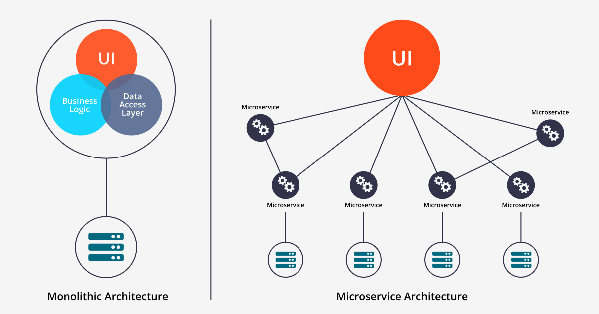

## MSA (MicroService Architecture) 개념정리

---

> [참고 사이트1](https://www.opsnow.com/%EC%9A%94%EC%A6%98-%EB%8C%80%EC%84%B8-msa/)
>
> [참고 사이트2](https://hahahoho5915.tistory.com/71)
>
> [참고 사이트3](http://clipsoft.co.kr/wp/blog/%EB%A7%88%EC%9D%B4%ED%81%AC%EB%A1%9C%EC%84%9C%EB%B9%84%EC%8A%A4-%EC%95%84%ED%82%A4%ED%85%8D%EC%B2%98msa-%EA%B0%9C%EB%85%90/)

## MSA (MicroService Architecture)

### 정의

- **느슨하게 결합**된 서비스의 모임으로 **구조화**하는 서비스 지향 아키텍처(SOA) 스타일의 일종인 **소프트웨어 개발 기법** 
- 각각을 마이크로하게 나눈 독립적인 서비스를 연결한 구조를 뜻한다. 
  - 이러한 특징 덕분에 시스템 전체의 중단 없이 필요한 부분만 업데이트 배포가 가능하다. 
  - 또한 유연한 대응이 가능해 실시간으로 요구사항을 반영할 수 있다. 

### SOA : 서비스 지향 아키텍처 (Service Oriented Architecture)

- 네트워크에서 **공통의 통신 언어**를 사용하는 서비스 인터페이스를 활용하여 소프트웨어 **구성 요소를 다시 사용**할 수 있게 만드는 소프트웨어 **설계 유형**이다. 
  - 별도로 배포 및 유지관리되는 소프트웨어 구성 요소를 **통합**하고, 이러한 구성 요소가 서로 통신하고 **연동**되도록 함으로써 여러 시스템에서 실행되는 소프트웨어 애플리케이션을 구성할 수 있게 한다. 

### 등장배경

- **Monolithic Architecture** 단점을 개선하기 위해 등장했다. 
  - **Monolithic Architecture**는 소프트웨어의 **모든 구성요소가 한 프로젝트에 통합되어 있는 서비스**이다. 
- 단점
  1. **부분 장애가 전체 서비스의 장애로 확대**될 수 있음
  2. **전체 시스템 구조 파악이 어려움**
  3. 서비스 변경이 어렵고, **수정 시 영향도(사이드 이펙트 등) 파악이 힘듦**
  4. **빌드 시간 및 테스트, 배포 시간의 급증**
  5. **서비스의 특정 부분만 스케일아웃(sacle-out) 하기 어려움**
- 따라서 소규모의 프로젝트에서는 유지보수가 편리해 좋지만 일정 규모 이상 넘어간 프로젝트에는 좋지 않다. 
  - MSA 가 나온 이유

### 특징 

1. API를 통해서만 상호작용할 수 있다. 
   - 따라서 서비스의 end-point(접근점) 을 **API 형태로 외부에 노출**하고 실질적인 **세부 사항은 모두 추상화** 한다. 
   - 내부의 구현 로직, 아키텍처와 프로그래밍 언어, 데이터베이스, 품질 유지 체계와 같은 기술적인 사항들은 서비스 API에 의해 가려진다. 
2. **마이크로서비스는** 하나의 비즈니스 범위에 맞춰 만들어지므로 **하나의 기능만 수행**한다. 
   - 따라서 자기가 **개발하는 서비스만 책임**지고 여러 어플리케이션에서 **재사용**할 수 있다. 
3. 기술 중립적 프로토콜을 사용해 통신하므로 서비스 구현 기술과는 무관하다. 
   - 따라서 마이크로서비스 기반의 어플리케이션을 **다양한 언어와 기술로 구축**할 수 있다.
4. **API Gateway**
   - MSA 방식의 문제점은 각 서비스가 다른 서버에 분리 배포되어있기 때문에 서버 URL이 각기 다르다는 것이다. 
     - 이때 API Gateway는 API 서버 앞 단에서 모든 API 서버들의 End-Point를 단일화하여 묶어주는 역할을 한다. 
     - 따라서 여러곳에 배포되어있는 api를 **API Gateway** 를 통해 쉽게 관리하고 구조 단순화 하여 문제점을 해결한다. .
5. 서비스별로 운영팀이 나눠진다. 
   - 서비스별 팀이 따로 구축되기 때문에 다른 팀에 대한 의존도가 낮아진다. 
     - 따라서 해당 서비스에 문제가 생겼을 때 다른 팀은 아무 상관이 없다. 

### 장점

1. 확장성
   - 특정 서비스를 다른곳에서도 똑같이 사용 가능 
   - 클라우드 기반 서비스 사용에 적합
2. 독립성
3. 간편한 배포 및 관리 
   - 서비스별 개별 배포가 가능
   - 특정 서비스 변경사항 적용 후 빠르게 배포 가능 
4. 개발시간 단축

### 단점

1. 마이크로서비스에 대한 내부 경험 부족
2. 복잡성이 늘어날 가능성
3. 구축에 소요되는 기간 및 비용에 대한 불확실성

